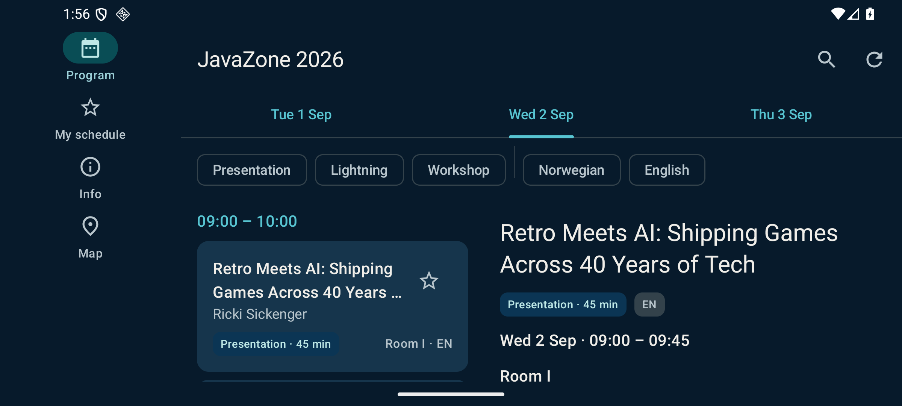
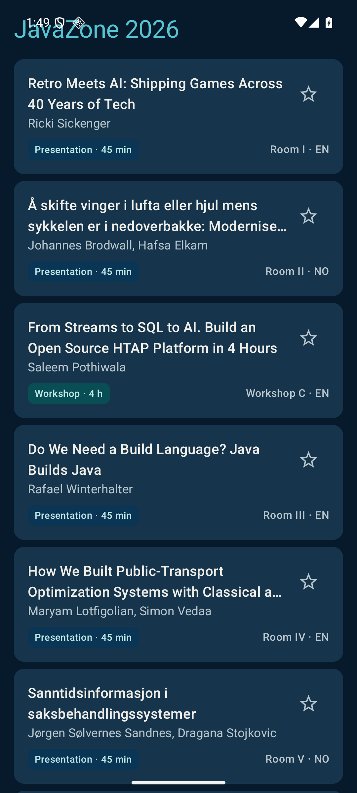
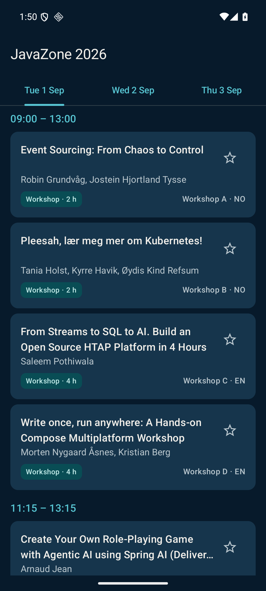
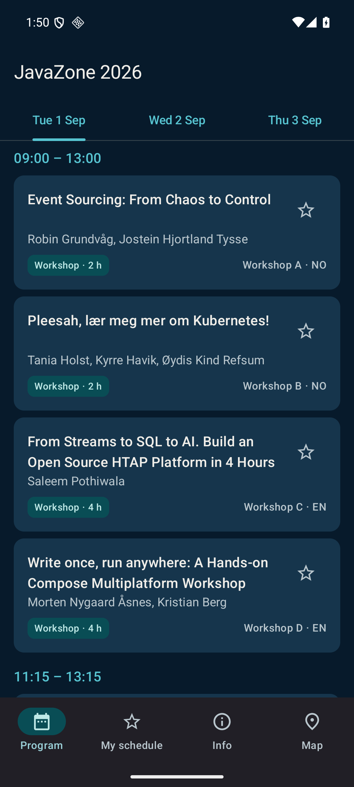
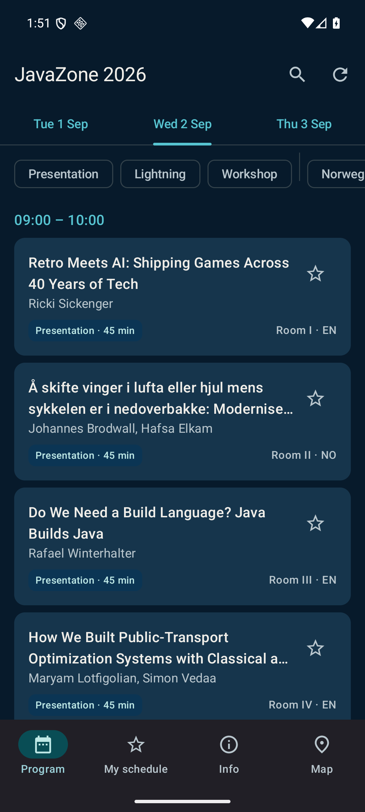
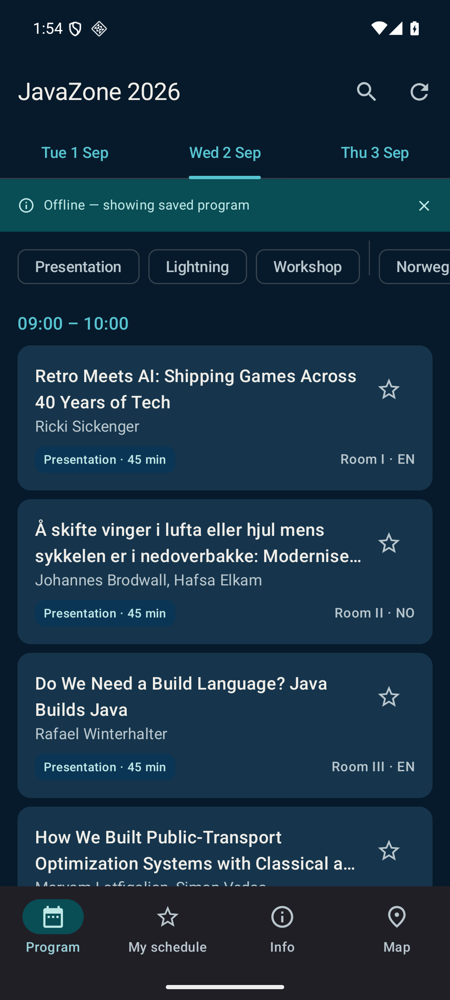
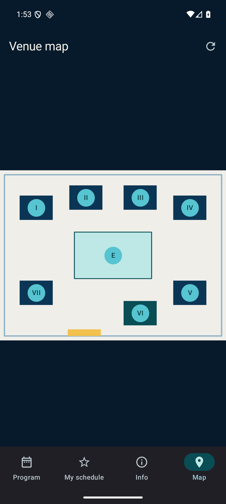

autoscale: true
slide-transition: fade(0.3)

# [fit] Practical Multiplatform Development
# [fit] with Compose and Kotlin

#

## JavaZone 2026 — 4-hour workshop

### Morten Nygaard Åsnes · Kristian Berg

^ Welcome everyone. Today we build a real app together: a conference app for JavaZone itself — the schedule you are attending right now, running from one Kotlin codebase on Android, iOS, Desktop and the Web. By the end of the day you will have written the UI, the state layer and the data layer yourself, and you leave with a complete template project you can reuse.

^ Housekeeping while people settle: make sure you cloned the repo and ran the setup script we sent out two weeks ago. If you didn't, start the Gradle sync NOW — details on the next slides — because conference wifi and Gradle are not friends.

---

# Your hosts

- **Morten Nygaard Åsnes** — Senior developer at Miles. Kotlin and Java ecosystem veteran, early adopter of Kotlin Multiplatform and Compose Multiplatform.
- **Kristian Berg** — Tech Lead, platform team at KS Digital. Two decades of Java, Kotlin for the last few years. javaBin Bergen since 2004, former javaBin board member.

^ Introduce yourselves briefly — one minute each. Morten: passionate about exploring new technology, has been building with KMP/CMP since the early days and has the scars to prove it. Kristian: the Java perspective — twenty years of Java, Kotlin added recently, so he knows exactly which parts of this feel foreign to a Java developer and which feel like home.

^ Point out that there are two of us for a reason: while one presents, the other walks the room during the hands-on tasks. Wave at us, we will come to you.

---

# Today, in five blocks

| Time | Block |
| :--- | :--- |
| 30 min | **0 — Kickoff & setup** |
| 90 min | **1 — Building the UI with Compose** |
| 45 min | **2 — State & architecture** |
| 45 min | **3 — Shared logic & data** |
| 30 min | **4 — Advanced DX & wrap-up** |

^ The structure the whole day follows: short theory bursts, then you code. Block 1 is the big one — 90 minutes with three hands-on tasks. Every task has a checkpoint branch, so if you fall behind you can jump to the next checkpoint and keep going. Nobody gets left in the ditch.

^ Breaks: we take a short break between blocks 1 and 2, and again between 3 and 4. Coffee is that way.

---

# Practical

- Workshop repo: `<REPO-URL>`
- Wifi: `<WIFI-NETWORK>` / password `<WIFI-PASSWORD>`
- Fell behind? Every task has a checkpoint branch:

```
git checkout checkpoint-3
```

- Task descriptions live in the repo under `docs/tasks/`

^ Get everyone to write down the repo URL now. The checkpoints are the safety net: checkpoint-1 is the state of the code after task 1, and so on. checkpoint-6 is the complete app. If a task defeats you, check out the next checkpoint and stay with the group — you can revisit later, the task docs have progressive hints in collapsible sections.

^ If your Gradle sync is still running: that's fine, we have 30 minutes of talking before you need a working build.

^ For anyone whose environment is misbehaving: the KMP plugin ships a "Project Environment Preflight Checks" tool window in the IDE (double-tap Shift, type "preflight") — it checks JDK, Android SDK and Xcode and says exactly what's missing. Faster than us guessing over your shoulder; SETUP.md §4 has it, along with kdoctor for the terminal-minded.

---

# [fit] Block 0
# [fit] Why multiplatform?

### 30 min — the why, the how, and Task 0

^ First: why does this technology exist at all? A little history, because the problem we are solving today is older than most frameworks — and this being JavaZone, the story starts with Java.

---

# Write once, run anywhere.

^ Sun Microsystems' slogan for Java, 1995. The JVM abstracted the hardware away: compile to bytecode once, run wherever a VM exists. It was a revolutionary promise — and this audience knows it worked spectacularly well… for servers.

^ Pause here. Ask the room: how many of you have shipped the same *client* application to two platforms from one codebase? Few hands. That's today's agenda.

---


^ Java did conquer a lot of surfaces — it ran on Blu-ray players, SIM cards, and three billion devices, allegedly. But on the client side, WORA never really landed: applets died, Swing apps never felt native anywhere, and when smartphones arrived, the client problem came back with a vengeance.

^ Placeholder image: Duke or the classic "3 billion devices" install screen. Swap in before the workshop.

---

# The problem

- We write the same app **twice**
  - Android: Kotlin, Jetpack Compose
  - iOS: Swift, SwiftUI
- Two teams, two build systems, two release trains
- Duplicated models, logic, tests — and duplicated bugs
- Features drift apart between platforms

^ This is the state of mobile development for most organizations. Every feature is specified once and implemented twice by people who can't easily review each other's code. The logic is identical — parse the same JSON, apply the same rules — but written in two languages. When the apps disagree, users notice.

^ What we want is WORA back, but this time including the UI, and without giving up native performance and platform integration. There has been no shortage of attempts.

---

# The competition

- **React Native** — JavaScript, native widgets via a bridge
- **Flutter** — Dart, custom rendering engine
- **.NET MAUI** — C#, the Xamarin lineage
- **Cordova / Ionic / PWA** — the web-view family

^ The serious contenders today are React Native and Flutter. React Native brings the JavaScript ecosystem and drives real native widgets; Flutter brings excellent tooling and paints every pixel itself with its own engine. Both are proven. But they share a cost: your team adopts a new language and a new ecosystem.

^ Our angle is different: we already write Kotlin (or Java, which is a short hop away). Kotlin Multiplatform lets us keep the language, the IDE, the libraries and the testing habits we already have — and share as much or as little as we want.

---

# How we got here

- **2016** — Kotlin 1.0
- **2017** — Kotlin/Native; official Android support; first "multiplatform projects" (Kotlin 1.2)
- **2019** — Kotlin becomes Google's preferred language for Android
- **2021** — Compose Multiplatform 1.0 (Desktop)
- **Oct 2023** — Kotlin Multiplatform declared **stable**
- **May 2025** — Compose Multiplatform **stable on iOS**
- **Sept 2025** — Compose for Web goes Beta
- **Jan 2026** — Compose Hot Reload 1.0, bundled and on by default

^ The timeline matters because it explains the maturity you'll feel today. KMP is not a 2024 experiment — the compiler technology is nearly a decade old, and the "share business logic" story has been production-ready since 2023. The UI story is newer: iOS went stable at KotlinConf in May 2025, and the developer-experience gaps (previews, hot reload) were closed over the last year.

^ The takeaway: the platform we teach today is the boring-in-a-good-way version. Everything in this workshop uses stable APIs, except the web target, which we'll be honest about in a minute.

---

# Kotlin Multiplatform (KMP)

- Share Kotlin code between Android, iOS, Desktop, Web and servers
- You choose **what** to share: models, logic, networking… or everything
- Mix in platform code where needed — `expect` / `actual`
- Full access to platform APIs from platform source sets

^ KMP is the code-sharing foundation. It is not a VM and not a bridge: your common Kotlin is compiled natively for each target. The crucial design decision is that sharing is opt-in and gradual — you can share a single validation function or an entire application. Native code is never more than one source set away.

^ We'll meet expect/actual properly in Block 3, where our app genuinely needs it — one storage implementation cannot cover all four targets.

---

# Kotlin/Native

- Compiles Kotlin to **native binaries** — no JVM at runtime
- LLVM-based compiler backend
- Targets: iOS, macOS, Linux, Windows, watchOS, tvOS
- Automatic memory management with a modern GC
- Two-way interop with Objective-C/Swift

^ Kotlin/Native is what makes iOS possible: your Kotlin becomes a regular Apple framework that Xcode links like any other. There is no VM shipped inside your iOS app. Memory is managed by Kotlin's own garbage collector, and the Objective-C interop means you can call any iOS API directly from Kotlin in the iosMain source set.

^ For a Java crowd: think of it as GraalVM native-image energy, but designed in from the start and aimed at Apple platforms.

---

# Compose Multiplatform (CMP)

- The **UI layer**: JetBrains' multiplatform distribution of Jetpack Compose
- Declarative, reactive UI in pure Kotlin
- Material 3 components included
- One `@Composable` tree runs on all four targets

^ Compose Multiplatform completes the picture: with KMP alone you'd still write SwiftUI for iOS. CMP takes Android's Jetpack Compose — the declarative UI toolkit that has already won on Android — and runs it everywhere. Same API, same mental model, same code.

^ If you have never seen Compose: you describe UI as functions of data. When the data changes, the framework recomposes the affected parts. That is the entire Block 1, so hold that thought.

---

# How it renders

| Platform | Rendering |
| :--- | :--- |
| Android | Jetpack Compose — this *is* the native UI toolkit |
| iOS | Skia via Metal, into a native `UIView` |
| Desktop (JVM) | Skia in a window |
| Web | Skia to a `<canvas>`, via WebAssembly |

^ Important architectural point: on Android, Compose Multiplatform simply is Jetpack Compose — nothing is emulated. Everywhere else, JetBrains renders with Skia, the same 2D engine behind Chrome and Flutter. So iOS gets pixel-perfect consistency with Android rather than SwiftUI widgets — that's a trade-off you should make consciously. Accessibility is bridged to the native layer (VoiceOver, TalkBack work).

^ The web target compiles Kotlin to WebAssembly and paints on a canvas — impressive, and improving fast (touch and scrolling got a big rework in CMP 1.11), but it's the youngest target, which the next slide quantifies.

---

# Current state — mid-2026 (1/2)

## Kotlin Multiplatform

| Platform | Stability |
| :--- | :--- |
| Android, iOS, Desktop (JVM), Server-side (JVM) | **Stable** |
| Web — Kotlin/JS | **Stable** |
| Web — Kotlin/Wasm | Beta |
| watchOS, tvOS | Beta |

^ Verified against kotlinlang.org in July 2026. The core targets we use today — Android, iOS, JVM desktop — are all stable. Kotlin/Wasm remains in Beta: JetBrains' own guidance is that it's ready for real-world use by early adopters, with minimal breaking changes expected. Our app targets it anyway, and you'll see it mostly Just Works.

---

# Current state — mid-2026 (2/2)

## Compose Multiplatform 1.11

| Platform | Stability |
| :--- | :--- |
| Android, iOS, Desktop (JVM) | **Stable** |
| Web (Kotlin/Wasm) | Beta |

- New since 2025: common `@Preview`, Navigation 3 support, **stable bundled Hot Reload**, iOS native text input

^ Same story on the UI side: three stable targets plus a beta web target. What changed in the last year is mostly developer experience — CMP 1.10 in January 2026 shipped a unified @Preview annotation that works in commonMain, brought Navigation 3 to non-Android targets, and bundled the now-stable Compose Hot Reload into the Gradle plugin, on by default. CMP 1.11 in May improved iOS text input and web scrolling.

^ Our app pins CMP 1.11.1 and Kotlin 2.4.0 — the latest stable versions as of July 2026, and they're frozen until after the workshop. Version discipline is a survival skill in this ecosystem; more on that in the wrap-up.

---

# Degrees of sharing

- **Share logic only** — ViewModels, repositories, networking, models
  Native UI: Jetpack Compose on Android, SwiftUI on iOS
- **Share logic + UI** — everything in Kotlin *(today's approach)*
- **Hybrid** — shared Compose UI, native components embedded where needed (maps, web views, camera)

^ You don't have to go all-in. Plenty of production KMP apps share only the domain layer and keep fully native UIs — that's the lowest-risk entry point and the classic pitch to an iOS team. Today we take the maximal path, 100% shared UI, because it teaches the most in four hours. Our advice: shared Compose UI is usually good enough, and the hybrid escape hatch exists for the places it isn't.

^ Foreshadowing: our venue map screen deliberately avoids native map SDKs and stays in pure Compose — we'll point at it later as a "degrees of sharing" decision in the wild.

---

# What we build today



## **JavaZone 2026** — the conference app

- Program with day tabs, filters, search
- Session details, speakers
- My schedule (favorites, persisted)
- Adaptive: phone, tablet, desktop, browser
- Live data via Ktor, offline fallback

^ This is the finished app — the screenshot shows it on desktop in the JavaZone dark theme and on a phone. It's an actually useful app: the real JavaZone 2026 program, 156 sessions, searchable, with your personal schedule persisted locally. Every task today builds a slice of it, and the complete source is checkpoint-6 in the repo.

^ Design constraint worth stating: every file in this app is small enough to fit on a slide. That's not an accident — the app is teaching material first.

---

# Project structure

```
composeApp/
  src/
    commonMain/      shared logic (KMP) + shared UI (CMP)
    androidMain/     Android-specific code
    iosMain/         iOS-specific code
    jvmMain/         Desktop-specific code
    wasmJsMain/      Web-specific code
  build.gradle.kts
iosApp/              Xcode wrapper project
```

^ One Gradle module, five source sets. Almost everything we write today lands in commonMain — that's the point. The platform source sets exist for the thin edges: app entry points, and the storage drivers we'll meet in Block 3. iosApp is a small Xcode project that embeds the Kotlin framework; you only open it to run on an iOS device or simulator.

^ commonMain code can't see platform APIs; platform source sets see commonMain plus their whole native world. The compiler enforces this, which is what makes the sharing trustworthy.

---

# Heads-up: new projects look different (AGP 9)

**This workshop (AGP 8.x)** — one module does everything:

```
composeApp/          KMP + Android app in ONE module
  src/androidMain/     MainActivity lives here
iosApp/
```

**New projects (AGP 9+)** — the Android app moves out:

```
androidApp/          com.android.application — MainActivity, manifest
composeApp/          com.android.kotlin.multiplatform.library
  src/androidMain/     only expect/actual stays here
iosApp/
```

- AGP 9 forbids `com.android.application` + the KMP plugin **in the same module**
- Shared module: `androidTarget {}` → `androidLibrary {}` (new dedicated plugin)

^ If you generate a fresh project from the KMP wizard after AGP 9, it won't match what you built today — say this now so nobody thinks the workshop taught them an obsolete layout. What changed: AGP 9.0 dropped support for applying com.android.application or com.android.library together with org.jetbrains.kotlin.multiplatform in one module. The replacement is a dedicated Android-KMP library plugin, com.android.kotlin.multiplatform.library, with its own `androidLibrary {}` DSL block inside `kotlin {}` — and the Android *app* entry point (MainActivity, manifest, Android resources) moves into its own small androidApp module that depends on the shared one. Structurally it then looks just like iOS already does: a thin platform host (androidApp, iosApp) around one shared module.

^ Why we teach the old layout anyway: this project pins AGP 8.13 on purpose (see SETUP.md — don't bump it), because the single-module version is simpler to navigate in a 4-hour workshop, and everything conceptual — source sets, expect/actual, per-source-set dependencies — is identical in both layouts. Migration is mechanical, and there's an official guide: kotlinlang.org/docs/multiplatform/multiplatform-project-agp-9-migration.html. Escape hatch if someone asks: `android.enableLegacyVariantApi=true` keeps the old layout building on AGP 9, but it's removed in AGP 10 (expected H2 2026), so it buys time, not a future.

---

# One `build.gradle.kts` declares all targets

`app/composeApp/build.gradle.kts`

```kotlin
kotlin {
    // JDK 21 toolchain (auto-provisioned via foojay): matches the JetBrains Runtime
    // that Compose Hot Reload runs the desktop app on.
    jvmToolchain(21)

    androidTarget { /* ... */ }

    iosArm64()
    iosSimulatorArm64()

    jvm()

    @OptIn(ExperimentalWasmDsl::class)
    wasmJs { /* ...browser { }, binaries.executable()... */ }
    // ...
}
```

^ This is the real build file from the app, trimmed. One `kotlin { }` block declares every compilation target. Note the JDK 21 toolchain — that's a Hot Reload requirement we cash in during Block 4, and it's why the setup script made you download a toolchain.

^ Dependencies are declared per source set, which the next slide shows — it's the mechanism that lets one library have different engines per platform.

---

# Dependencies per source set

`app/composeApp/build.gradle.kts`

```kotlin
sourceSets {
    commonMain.dependencies {
        implementation(compose.material3)
        implementation(libs.androidx.navigation.compose)
        implementation(libs.ktor.client.core)
        implementation(libs.sqldelight.runtime)
        // ...
    }
    androidMain.dependencies {
        implementation(libs.ktor.client.okhttp)
        implementation(libs.sqldelight.android.driver)
        // ...
    }
    iosMain.dependencies {
        implementation(libs.ktor.client.darwin)
        implementation(libs.sqldelight.native.driver)
    }
    // ...jvmMain, wasmJsMain follow the same pattern...
}
```

^ Read this as: common code depends on the platform-neutral API artifacts, and each platform adds its concrete implementation — an HTTP engine here, a database driver there. Common code never knows which engine it got. This exact pattern shows up twice more today, in the Ktor task and the SQLDelight task, so don't memorize it now; just recognize the shape.

---

# Versions: `gradle/libs.versions.toml`

```toml
[versions]
kotlin = "2.4.0"
composeMultiplatform = "1.11.1"
ktor = "3.5.1"
sqldelight = "2.3.2"
androidxNavigation = "2.9.2"
# ...

[libraries]
ktor-client-core = { module = "io.ktor:ktor-client-core", version.ref = "ktor" }
ktor-client-okhttp = { module = "io.ktor:ktor-client-okhttp", version.ref = "ktor" }
ktor-client-darwin = { module = "io.ktor:ktor-client-darwin", version.ref = "ktor" }
ktor-client-js = { module = "io.ktor:ktor-client-js", version.ref = "ktor" }
```

^ The version catalog is the single source of truth for versions — the `libs.` references you saw on the previous slide resolve here. These are the exact versions in the starter you cloned: Kotlin 2.4.0, Compose Multiplatform 1.11.1, Ktor 3.5.1, SQLDelight 2.3.2. They were locked in July and will not move before the workshop — dependency bumps in this stack are where the dragons live.

---

# One `App()`, four hosts

```kotlin
// jvmMain — main.kt
fun main() = application {
    Window(onCloseRequest = ::exitApplication, title = "JavaZone 2026") {
        App()
    }
}

// iosMain — MainViewController.kt
fun MainViewController() = ComposeUIViewController { App() }

// wasmJsMain — main.kt
fun main() {
    ComposeViewport(document.body!!) {
        App()
    }
}
```

^ These are the complete platform entry points — real files, not excerpts. Desktop is a main function that opens a window; iOS exposes a UIViewController that the Xcode wrapper presents; web mounts into the document body; Android (not shown) is an Activity calling setContent { App() }. Everything below App() is shared. When people ask "how much platform code does a CMP app need", this slide is the answer: roughly one slide worth.

^ Compilation per platform: Android compiles to JVM bytecode via Kotlin/JVM; iOS to a native framework via Kotlin/Native and LLVM; desktop to regular jars; web to a .wasm binary with JS glue.

---

# Task 0 — Run it

## ~10 min · checkpoint: `main` (= checkpoint-0)


**Goal:** the starter app runs on at least two targets on your machine.

1. `./gradlew :composeApp:run` — desktop first, it's the fastest
2. Run on the Android emulator from the IDE
3. Mac users: run the iOS app via the `iosApp` run configuration
4. Web: `./gradlew :composeApp:wasmJsBrowserDevelopmentRun`
5. Open `src/` and find the five source sets

^ Desktop first — it gives the fastest feedback loop and needs no emulator, which is why we use it for most of the day. Windows/Linux folks: no iOS for you, as advertised; Android plus desktop plus web is plenty. While apps are building, actually do step 5 — orient yourself in the source tree, find commonMain, find App.kt.

^ Roam the room now. Classic failure modes from our dry runs: missing Android SDK licenses, no emulator image created, Xcode command line tools not installed, corporate proxy blocking Gradle. The task doc has a troubleshooting section for each.

---

# [fit] Block 1
# [fit] Building the UI with Compose

### 90 min — fundamentals · layouts · adaptive UI · Tasks 1–3

^ The big block. Pattern: about ten minutes of concepts, then you build the session card; short theory again, then the program list; once more, then the adaptive layout. By the end of this block the app looks like a real app on every screen size.

---

# UI as functions

`…/ui/components/States.kt`

```kotlin
/** First launch, nothing cached yet (DESIGN.md §3.7). */
@Composable
fun LoadingState(modifier: Modifier = Modifier) {
    Column(
        modifier = modifier.fillMaxSize(),
        horizontalAlignment = Alignment.CenterHorizontally,
        verticalArrangement = Arrangement.Center,
    ) {
        CircularProgressIndicator()
        Text(
            text = "Loading program…",
            style = MaterialTheme.typography.bodyMedium,
            color = MaterialTheme.colorScheme.onSurfaceVariant,
            modifier = Modifier.padding(top = 16.dp),
        )
    }
}
```

^ This is a complete, real screen state from the app — provided in your starter under `ui/components/States.kt`, you'll wire it up in Block 2. A composable is a function annotated with @Composable that *emits* UI — it doesn't return a view object, it describes what should exist. You build UIs by composing functions that call functions: LoadingState calls Column, which wraps a progress indicator and a text.

^ Things to point at: naming is PascalCase like a class, because conceptually it's a UI element, not an action. Parameters are plain data plus an optional Modifier — that trailing `modifier` parameter with a default is *the* Compose convention, and every component you write today should have one.

---

# Composition & recomposition

- Running a `@Composable` builds the **composition** — a tree of UI nodes
- Composables that **read state** are subscribed to it
- State changes → only the readers re-execute: **recomposition**
- Your functions may run *often* and *in any order*
  → keep them fast and side-effect free

^ The reactive core of Compose in four bullets. You never update the UI — you update state, and the framework re-runs exactly the functions that read it. This is why composables must be honest functions of their inputs: no network calls, no mutation of globals inside composition.

^ Analogy for the Java folks: think of a composable as a pure render method that the framework is free to call whenever its inputs change — like a spreadsheet cell recalculating. Where do you put things that must survive re-runs? That's `remember`, three slides from now.

---

# Layout: `Column`, `Row`, `Box`

`…/ui/detail/SpeakerRow.kt`

```kotlin
Row(horizontalArrangement = Arrangement.spacedBy(12.dp)) {
    Surface(
        shape = CircleShape,
        color = MaterialTheme.colorScheme.primaryContainer,
        modifier = Modifier.size(40.dp),
    ) {
        Box(Modifier.fillMaxSize(), contentAlignment = Alignment.Center) {
            Text(speaker.name.initials(), style = MaterialTheme.typography.titleMedium)
        }
    }
    Column(Modifier.weight(1f)) {
        Text(speaker.name, style = MaterialTheme.typography.titleSmall)
        // ...bio text and social-link chips...
    }
}
```

^ The three primitive layouts: Column stacks vertically, Row lays out horizontally, Box overlays and centers. This real snippet is the speaker row from our session detail screen — a circular monogram avatar next to a column of name and bio. It uses all three primitives in ten lines.

^ Note `Modifier.weight(1f)` on the Column: inside a Row, weight distributes leftover space — the avatar takes its 40 dp, the text column takes everything else. Same API as weights in a Column. There is no XML, no constraint language: layout is just nesting and parameters.

---

# Modifiers — and why order matters

```kotlin
// SessionDetailScreen.kt — pad first, then fill, then scroll:
Box(Modifier.padding(padding).fillMaxSize().verticalScroll(rememberScrollState()))

// EmptyState.kt — top margin, then a width cap:
modifier = Modifier.padding(top = 8.dp).widthIn(max = 320.dp)

// TimeSlotHeader.kt — layout first, then semantics:
modifier = Modifier
    .padding(vertical = 8.dp)
    .semantics { heading() }
```

^ Modifiers decorate a composable: size, padding, clicks, scrolling, semantics — all chained. The crucial rule: **the chain is applied in order**, outside-in. `padding(16.dp).background(...)` gives you a margin outside the background; `background(...).padding(16.dp)` paints first and pads inside — visually completely different. When your layout looks wrong today, the first thing to check is modifier order.

^ All three lines are from the app. The last one is a nice accessibility freebie: marking the sticky time headers as headings lets screen-reader users jump slot by slot through the program.

---

# Material 3, batteries included

- `Scaffold`, `TopAppBar`, `NavigationBar`, `NavigationRail`
- `Card`, `Surface`, `Text`, `Icon`, `IconButton`
- `PrimaryTabRow`, `FilterChip`, `AssistChip`, `Badge`
- `FilledTonalButton`, `CircularProgressIndicator`
- All themed by `MaterialTheme` — colors, typography, shapes

^ Compose Multiplatform ships the full Material 3 component library, and our entire app is built from stock components — this list is literally the app's component diet. That's a deliberate design rule: no custom-drawn widgets (one exception: the map markers), because stock components give you ripple, focus rings, keyboard navigation and screen-reader support for free on every platform.

^ You'll use Card, Text and IconButton in Task 1 within the next fifteen minutes, so let's see how they get their colors.

---

# Theming: the JavaZone palette

`…/ui/theme/Theme.kt`

```kotlin
private val DarkColors = darkColorScheme(
    primary = Color(0xFF57C4D1),            // blue lagoon
    tertiary = Color(0xFFF2C14E),           // sunbeam gold — pops on navy
    background = Color(0xFF071A2B),         // abyss navy — THE brand background
    // ...
)

@Composable
fun JavaZoneTheme(
    darkTheme: Boolean = isSystemInDarkTheme(),
    content: @Composable () -> Unit,
) {
    MaterialTheme(
        colorScheme = if (darkTheme) DarkColors else LightColors,
        content = content,
    )
}
```

^ A theme in Material 3 is just data: two color schemes, defaults for typography and shapes. Our palette is extracted from the actual 2026.javazone.no website — deep ocean blues, sunbeam gold for favorites. The one-sentence design system: blue is brand and navigation, teal supports, gold means "yours". We kept default fonts and shapes on purpose so the theme stays a colors-only lesson.

^ Note the signature: `content: @Composable () -> Unit`. The theme takes the whole app as a lambda parameter. Park that thought — it's the slot API pattern, formally introduced after Task 1.

---

# Local state: `remember` + `mutableStateOf`

```kotlin
// MapScreen.kt — state that survives recomposition:
val transform = remember { MapTransform() }
var selectedMarker by remember { mutableStateOf<VenueMarker?>(null) }

// ProgramScreen.kt — keyed remember: recompute only when `state` changes
val slots = remember(state) { state.daySlots(state.selectedDay) }
```

- `mutableStateOf` — an observable value; reads subscribe, writes recompose
- `remember` — caches across recompositions
- `remember(key)` — recomputes when the key changes

^ The two halves of Compose state. `mutableStateOf` creates an observable holder: any composable that reads it recomposes when it changes. `remember` keeps a value alive across recompositions — without it, every re-run would create a fresh object and you'd lose your state. The `by` delegate is sugar so you write `selectedMarker` instead of `selectedMarker.value`.

^ The keyed form doubles as memoization: grouping 156 sessions into time slots isn't free, so the program list only recomputes it when the state object actually changes. All lines are from the real app — the map screen keeps its zoom state exactly this way.

---

# Previews

`…/ui/components/SessionCard.kt`

```kotlin
import org.jetbrains.compose.ui.tooling.preview.Preview   // ⚠️ not the androidx one!

@Preview
@Composable
private fun SessionCardPreview() {
    JavaZoneTheme(darkTheme = false) {
        SessionCard(sampleSession, isFavorite = true, onClick = {}, onToggleFavorite = {})
    }
}

@Preview
@Composable
private fun SessionCardPreviewDark() {
    JavaZoneTheme(darkTheme = true) {
        SessionCard(sampleSession, isFavorite = false, onClick = {}, onToggleFavorite = {})
    }
}
```

^ Previews render a composable in the IDE without launching anything. You wrap your component in the theme, feed it fixture data — `sampleSession` is a fixture in the starter — and see light and dark variants side by side. Since Compose Multiplatform 1.10 there's a single common `@Preview` annotation that works in commonMain, so these previews live right next to the shared code.

^ Point at the import line — it's on the slide for a reason: the IDE will offer `androidx.compose.ui.tooling.preview.Preview` first, and the compiler's deprecation warning even tells you to switch to it — but with this project's dependencies that import doesn't exist on iOS/wasm. It compiles fine on desktop, so the breakage only surfaces when someone builds iOS hours later. Use `org.jetbrains.compose.ui.tooling.preview.Preview` and ignore the deprecation warning today.

^ Previews are static; for interactive iteration the desktop target plus Hot Reload is the power tool, demoed in Block 4. In Task 1, starting from the preview and building the card inside it is the intended workflow.

---

# Task 1 — `SessionCard`

## ~25 min · `checkpoint-1`



**Goal:** build the composable that renders one session in the list.

1. Create `SessionCard.kt` in `ui/components/`
2. `Card` with `onClick`; inside: a `Column` of title, speakers, metadata
3. Title: `titleMedium`, `maxLines = 2`, ellipsis; star `IconButton` to the right
4. Add the `FormatBadge` sub-composable (colored `Surface` + label)
5. `@Preview` it with `sampleSession` — light *and* dark
   (import: `org.jetbrains.compose.ui.tooling.preview.Preview`)

^ Your first composable, and the single most reused component in the app — everything else displays lists of these. The task doc has the full spec: which typography roles, which colors for which format, and the accessibility requirement that the star's contentDescription must include the session title. Hints are collapsible; try without them first.

^ Repeat the @Preview import warning from two slides ago while people work — anyone who lets the IDE pick the androidx import has planted a silent iOS/wasm build failure for later. The task doc has the callout in bold.

^ Time-box gently: the core card takes most people 15 minutes, the FormatBadge is the stretch within the task. Anyone racing ahead can add the `selected` highlight parameter — Task 3 actually uses it. Compare with checkpoint-1 when done.

---

# Slot APIs

`…/ui/program/ProgramScreen.kt`

```kotlin
Scaffold(
    topBar = {
        TopAppBar(
            title = {
                if (searchActive) {
                    SearchField(/* ... */)
                } else {
                    Text("JavaZone 2026")
                }
            },
            actions = { /* ...search and refresh IconButtons... */ },
        )
    },
) { padding ->
    Column(Modifier.padding(padding)) { /* ...the screen... */ }
}
```

^ The pattern that makes Compose components reusable: instead of taking a string, a component takes a *composable lambda* — a slot — and you fill it with whatever you like. Scaffold has slots for the top bar and content; TopAppBar has slots for title and actions. Here our program screen swaps the entire title area between a text and a search field. No inheritance, no XML includes — just lambdas.

^ You already own a slot API without noticing: JavaZoneTheme's `content` parameter. Every reusable component you write should consider: is this parameter data, or should it be a slot?

---

# One component, every empty case

`…/ui/components/EmptyState.kt`

```kotlin
@Composable
fun EmptyState(
    icon: ImageVector,
    title: String,
    body: String,
    actionLabel: String? = null,
    onAction: () -> Unit = {},
    modifier: Modifier = Modifier,
) { /* centered icon + title + body + optional button */ }
```

- "No sessions match" · "Nothing here yet" · "Couldn't load" · "Session not found"

^ Reuse in practice: this one small component renders every empty, error and placeholder state in the app — four different screens, one implementation. The parameters follow the conventions from this block: data parameters first, optional behavior with defaults, trailing modifier. When you catch yourself copy-pasting a Column with an icon and two texts, that's the signal to extract.

^ In Task 2 you'll use it for the "no sessions match the filter" case rather than building your own.

---

# Lazy lists + sticky headers

`…/ui/components/SessionList.kt`

```kotlin
LazyColumn(
    modifier = modifier,
    contentPadding = PaddingValues(start = 16.dp, end = 16.dp, bottom = 24.dp),
) {
    slots.forEach { slot ->
        stickyHeader(key = "header-${slot.start}") {
            TimeSlotHeader(slot.start, slot.end)
        }
        items(slot.sessions, key = { it.id }) { session ->
            SessionCard(
                session = session,
                isFavorite = session.id in favoriteIds,
                onClick = { onSessionClick(session.id) },
                onToggleFavorite = { onToggleFavorite(session.id) },
                // ...
            )
        }
    }
}
```

^ LazyColumn is Compose's RecyclerView: it composes only the visible items, so 156 sessions scroll smoothly even on the web target. The DSL takes item *descriptions*, not composables directly — `items(list) { }` per group, and `stickyHeader` gives us the time-slot headers that pin to the top while their group scrolls. That's the whole "sessions grouped by time" UI.

^ Two details that separate working code from correct code: stable `key`s let Compose track items across data changes (scroll position, animations), and `contentPadding` pads *inside* the scrolling region so content isn't clipped at the edges.

---

# Task 2 — Program list

## ~30 min · `checkpoint-2`



**Goal:** a scrollable, day-tabbed program of all 156 sessions from the bundled JSON.

1. Load sessions from the bundled `program.json` (loader provided in the starter)
2. Group by day and time slot with `toConferenceDays()` (provided)
3. `LazyColumn` of `SessionCard`s with `stickyHeader` time slots
4. `PrimaryTabRow` day tabs: Tue / Wed / Thu
5. Wire the `EmptyState` fallback for a day with no slots

^ Now the card meets real data. The starter provides the JSON loading and the grouping logic — the data layer is Block 3's business — so this task is purely about assembling the list UI: LazyColumn, stickyHeader, keys, tabs. Selected-day state is a plain `remember { mutableStateOf(...) }` in the screen for now; moving it somewhere proper is exactly what Block 2 is about, and feeling that pain first is intentional.

^ Manage expectations on step 5: with the real data every day has sessions, so nobody will *see* the EmptyState fire today — it's defensive wiring that becomes real once Task 4 adds filters. Say so, or someone will burn ten minutes hunting for an empty day.

^ Checkpoint-2 if the grouping fights you. Fast finishers: wire up the day tabs so each day keeps its own scroll position, or add the FilterChipsRow from the finished app.

---

# One codebase, every window size

| Width class | Width | Navigation | Program |
| :--- | :--- | :--- | :--- |
| **Compact** | < 600 dp | `NavigationBar` (bottom) | single pane |
| **Medium** | 600–839 dp | `NavigationRail` (left) | single pane |
| **Expanded** | ≥ 840 dp | `NavigationRail` (left) | **list-detail** |

^ Headline topic from the abstract: the same code must feel right on a phone, a tablet, a desktop window and a browser. Material's answer is window size classes — buckets instead of pixel-perfect breakpoints. We use the two canonical width breakpoints, 600 and 840 dp, and deliberately ignore height classes: an acceptable simplification for a 4-hour workshop, and we say so.

^ The sentence to remember: **two breakpoints, two independent decisions.** Only the navigation container changes at 600 dp; only the pane layout changes at 840 dp. Resize a desktop window across both and you cross all three columns of this table live.

---

# Reading the window size

`…/ui/AdaptiveScaffold.kt`

```kotlin
/** Width class per DESIGN.md §2 — decisions are made on width only. */
enum class WindowWidth { Compact, Medium, Expanded }

@Composable
fun currentWindowWidth(): WindowWidth {
    val sizeClass = currentWindowAdaptiveInfo().windowSizeClass
    return when {
        sizeClass.isWidthAtLeastBreakpoint(WindowSizeClass.WIDTH_DP_EXPANDED_LOWER_BOUND) ->
            WindowWidth.Expanded
        sizeClass.isWidthAtLeastBreakpoint(WindowSizeClass.WIDTH_DP_MEDIUM_LOWER_BOUND) ->
            WindowWidth.Medium
        else -> WindowWidth.Compact
    }
}
```

^ `currentWindowAdaptiveInfo()` comes from the multiplatform material3-adaptive library and works identically on all four targets — on desktop it tracks the live window size, so this value *changes as the user drags the window edge*, and everything reading it recomposes. Adaptive layout is just state, like everything else in Compose.

^ We fold the library's size class into our own three-value enum so the rest of the UI code speaks our vocabulary and the library type stays in one file.

---

# `AdaptiveScaffold`: bar or rail

`…/ui/AdaptiveScaffold.kt`

```kotlin
if (windowWidth == WindowWidth.Compact) {
    Scaffold(
        bottomBar = {
            if (!onSessionDetail) {
                NavigationBar {
                    // ...one NavigationBarItem per TopDestination...
                }
            }
        },
    ) { padding ->
        Box(Modifier.padding(padding).consumeWindowInsets(padding)) { content() }
    }
} else {
    Row(Modifier.fillMaxSize()) {
        NavigationRail {
            // ...the same items, as NavigationRailItem...
        }
        Box(Modifier.weight(1f)) { content() }
    }
}
```

^ The whole 600 dp decision is one `if`. Compact gets a Scaffold with a bottom NavigationBar; everything wider gets a Row with a NavigationRail on the left. Same four destinations, same icons, same selection logic — the items are driven by a little `TopDestination` enum (route, label, filled and outlined icon), so the two branches can't drift apart.

^ Two production details in the small print: the bottom bar hides on the pushed session-detail route, because that's a focused reading view; and `consumeWindowInsets` stops the inner screens' own TopAppBars from double-applying the status-bar inset. Both are the kind of thing you get from reading a finished app rather than a hello-world.

---

# List-detail: the 840 dp decision

`…/ui/components/ListDetailLayout.kt`

```kotlin
/**
 * The Task 3 punchline: on expanded windows "detail" is a second pane, not a
 * navigation destination. Compact/medium render only the list; the detail is
 * a pushed route there.
 */
@Composable
fun ListDetailLayout(
    expanded: Boolean,
    list: @Composable () -> Unit,
    detail: @Composable () -> Unit,
) {
    if (expanded) {
        Row(Modifier.fillMaxSize()) {
            Box(Modifier.weight(0.42f)) { list() }
            Box(Modifier.weight(0.58f)) { detail() }
        }
    } else {
        list()
    }
}
```

^ The complete file — this is the entire two-pane implementation, a weighted Row with two slots. On a phone, tapping a card navigates to a detail screen; on a desktop, tapping a card sets a `selectedSessionId` and this second pane renders it. Same SessionDetailContent composable in both hosts: **one detail composable, two hosts** is the takeaway.

^ Read the doc comment: on big screens, "detail" is *state*, not a *destination*. That distinction is the bridge into Block 2, where we make it concrete in the navigation code. (material3-adaptive has a fancier ListDetailPaneScaffold; the weighted Row is the beginner-proof baseline we teach.)

---

# What changes — and what doesn't

**Changes per window class:**

- Navigation container (bar ↔ rail) at 600 dp
- Pane count on Program & My Schedule at 840 dp
- Content max width (840 dp, centered) on big screens

**Identical everywhere:**

- Every composable below the scaffold — zero `expect`/`actual` in UI code
- All state, ViewModels, routes, theme
- Touch, mouse and keyboard handling

^ Give this one some weight, because it's the sales pitch of the day: the adaptive layer is two small files, and *everything else is byte-for-byte the same code* on a phone and a 27-inch monitor. SessionCard doesn't know how wide the window is. There is not a single expect/actual in the UI.

^ Keyboard support came for free because we only used stock M3 clickable components — tab through cards, Enter activates, Esc goes back on desktop. The one place we do custom pointer handling, the map, is also where we had to hand-build a reset button so keyboard users aren't locked out. Free lunch ends where custom drawing begins.

---

# Task 3 — Adaptive layout

## ~25 min · `checkpoint-3`



**Goal:** bottom bar on the phone, rail + two panes on desktop — same code.

1. Add `currentWindowWidth()` using `currentWindowAdaptiveInfo()`
2. Build `AdaptiveScaffold`: `NavigationBar` when compact, `NavigationRail` otherwise
3. Add `ListDetailLayout` and use it on the Program screen
4. Track `selectedSessionId`; highlight the selected card (`selected` param!)
5. Run on desktop **and** the phone/emulator — resize the window across 600/840 dp

^ The payoff task of Block 1. Step 5 is not optional — the moment where you drag the desktop window narrower and watch the rail become a bottom bar is the demo you'll be showing your team next week. The starter has the four destinations as an enum; the task doc includes the NavigationBarItem/RailItem code shape so nobody drowns in parameters.

^ Tell the room the detail pane is allowed to be a placeholder — a title and a "select a session" message is enough. checkpoint-3 contains a fleshed-out SessionDetailContent, so people comparing afterward may think they under-delivered; they didn't, the real detail screen is Task 4 material.

^ The selection-state plumbing (step 4) is intentionally a bit awkward while state still lives inside composables — one more nudge toward Block 2. Checkpoint-3 gets everyone level before the architecture block. Then: break.

---

# [fit] Block 2
# [fit] State & architecture

### 45 min — hoisting · UDF · MVVM vs MVI · navigation · Task 4

^ Block 1 left us with state scattered across screens in `remember` blocks. This block moves it somewhere it can be tested, shared between screens, and survive rotation — and we sort through the architecture alphabet soup.

---

# State hoisting

`…/ui/components/SessionCard.kt`

```kotlin
@Composable
fun SessionCard(
    session: Session,          // state flows DOWN
    isFavorite: Boolean,       // state flows DOWN
    onClick: () -> Unit,               // events flow UP
    onToggleFavorite: () -> Unit,      // events flow UP
    selected: Boolean = false,
    modifier: Modifier = Modifier,
) { /* ... */ }
```

- The card **owns no state** — it renders inputs and reports events
- Stateless components: previewable, reusable, testable

^ You already did this in Task 1, possibly without noticing: SessionCard doesn't decide whether it's a favorite — it's *told*, and when the star is tapped it just calls a lambda. The state lives higher up. That's state hoisting: lift state to the lowest common owner, pass values down and events up.

^ This is why your preview worked with any combination of inputs, and why the same card serves the Program list, My Schedule, and the selected-highlight case in the two-pane layout. A component that owns its own state can only ever tell one story.

---

# Unidirectional data flow

```
        ┌──────────────┐
        │   UiState    │
        └──────┬───────┘
     state     │      ▲     events
     flows     ▼      │     flow
        ┌──────────────┐
        │      UI      │
        └──────────────┘
```

- One owner of truth; UI renders state, emits events
- Events produce a **new** state; UI recomposes
- No `view.setText(...)` anywhere — ever

^ Hoist state all the way up and you get a loop: a single state object flows down, events flow up, the handler computes a new state, Compose recomposes. Data moves in one direction around the circle — hence unidirectional data flow. Every modern UI architecture is a variation of this loop; they differ only in how much ceremony surrounds the two arrows.

^ The payoff is debuggability: when the UI is wrong, the state is wrong, and there is exactly one place that writes the state. Compare with the two-way data-binding spaghetti some of us remember.

---

# MVVM vs MVI — honestly

| | MVVM | MVI |
| :--- | :--- | :--- |
| State | several observable properties | **one** immutable state object |
| Input | one method per action | **one** sealed intent type |
| Updates | ad hoc, anywhere in the VM | pure reducer function |
| Ceremony | low | higher |
| Wins | familiar, quick | log/replay/test every action |

^ The two acronyms the CFP promised. MVVM: a ViewModel exposes observable state and public methods; the UI calls methods. MVI: the UI sends *intent values* into a single entry point, and a reducer folds each intent into the next immutable state. MVI buys you a single choke point — log every intent and you have a replayable session — at the cost of more types and boilerplate.

^ Our take: for most teams the difference matters less than the discipline both enforce — immutable state, single source of truth, events up. Frameworks fight over the last 10%. Our app deliberately sits between the two, next slide.

---

# Our choice: MVVM with MVI-flavored intents

`…/ui/program/ProgramIntent.kt`

```kotlin
/** Everything the user can do on the program screens, as data (MVI-flavored MVVM). */
sealed interface ProgramIntent {
    data class SelectDay(val day: LocalDate) : ProgramIntent
    data class ToggleFormat(val format: Format) : ProgramIntent
    data class ToggleLanguage(val language: String) : ProgramIntent
    data class Search(val query: String) : ProgramIntent
    data object ClearFilters : ProgramIntent
    data class ToggleFavorite(val sessionId: String) : ProgramIntent
    data class SelectSession(val sessionId: String?) : ProgramIntent
    data object DismissOfflineBanner : ProgramIntent
    data object Retry : ProgramIntent
}
```

^ The complete file. This sealed interface is the entire user-facing API of the program feature: nine things a user can do, as data. The UI's only job is to translate gestures into these values — every screen gets one `onIntent: (ProgramIntent) -> Unit` lambda instead of nine callbacks.

^ Why hybrid and not pure MVI? We keep a plain ViewModel with a `when` over intents rather than a formal reducer pipeline — no middleware, no effects system — because that machinery doesn't pay for itself in an app this size, or frankly in many production apps. We keep the sealed intents because a closed, exhaustively-checked list of "everything that can happen" is the part of MVI that's nearly free and immediately useful: add an intent, and the compiler points at the `when` you must extend.

---

# One immutable `UiState`

`…/ui/program/ProgramUiState.kt`

```kotlin
/** Single immutable snapshot of everything the program screens render. */
data class ProgramUiState(
    val isLoading: Boolean = true,
    val loadFailed: Boolean = false,
    val isOffline: Boolean = false,
    val sessions: List<Session> = emptyList(),
    val favoriteIds: Set<String> = emptySet(),
    val selectedDay: LocalDate? = null,
    val activeFormats: Set<Format> = emptySet(),
    val activeLanguages: Set<String> = emptySet(),
    val searchQuery: String = "",
    val selectedSessionId: String? = null,
    // ...
) {
    val showOfflineBanner: Boolean get() = isOffline && !offlineBannerDismissed

    /** The selected day's slots with format/language filters applied (Program tab). */
    fun daySlots(day: LocalDate?): List<TimeSlot> =
        sessions.filter { it.matchesFilters() }.slotsFor(day)
}
```

^ The other half of the contract: one data class holds everything the program screens render. It's immutable — updates create a copy — so a state can never be half-updated, and any snapshot can be dropped into a preview or a test. Defaults describe the initial state: loading, nothing selected.

^ Note the derived members: filtering and search live *here*, as pure functions of the state, not in the composables and not even in the ViewModel's update logic. That means the interesting logic is testable without any UI or coroutines — you'll see exactly that in the Block 4 tests. This file is plain Kotlin in commonMain; nothing about it knows Compose exists.

---

# The ViewModel: `StateFlow` in commonMain

`…/ui/program/ProgramViewModel.kt`

```kotlin
/** Owns the program data and favorites; the UI only sends [ProgramIntent]s. */
class ProgramViewModel(
    private val repository: ProgramRepository = ProgramRepository(),
) : ViewModel() {

    private val _state = MutableStateFlow(ProgramUiState())
    val state: StateFlow<ProgramUiState> = _state.asStateFlow()

    init {
        loadProgram()
        viewModelScope.launch {
            repository.favoriteIds.collect { ids ->
                _state.update { it.copy(favoriteIds = ids) }
            }
        }
    }
    // ...
}
```

^ Yes, this is androidx.lifecycle.ViewModel — in common code, running on iOS and in a browser. JetBrains ships multiplatform builds of the lifecycle and navigation libraries, so the idioms Android developers already know transfer wholesale. The private MutableStateFlow / public read-only StateFlow pair is the standard encapsulation: only the ViewModel writes.

^ `viewModelScope` is a coroutine scope tied to the ViewModel's lifetime — when the ViewModel is cleared, in-flight work is cancelled. In `init` it subscribes to the favorites Flow from the repository, so favorites persist-and-update reactively once Block 3 plugs in real storage. Manual constructor injection with a default — no DI framework today, and you often don't need one.

---

# Handling intents

`…/ui/program/ProgramViewModel.kt`

```kotlin
fun onIntent(intent: ProgramIntent) {
    when (intent) {
        is ProgramIntent.SelectDay ->
            _state.update { it.copy(selectedDay = intent.day) }
        is ProgramIntent.Search ->
            _state.update { it.copy(searchQuery = intent.query) }
        is ProgramIntent.ToggleFavorite ->
            viewModelScope.launch { repository.toggleFavorite(intent.sessionId) }
        is ProgramIntent.SelectSession ->
            _state.update { it.copy(selectedSessionId = intent.sessionId) }
        ProgramIntent.Retry -> loadProgram()
        // ...ToggleFormat, ToggleLanguage, ClearFilters, DismissOfflineBanner...
    }
}
```

^ The single entry point. Most intents are one-liners: copy the state with one field changed — `update` does an atomic compare-and-set on the StateFlow, so concurrent updates can't lose writes. The `when` over a sealed type is exhaustive: forget a branch and it won't compile.

^ Where this departs from pure MVI: ToggleFavorite doesn't update state at all — it fires a suspend call at the repository, and the new favorites arrive back through the Flow subscription from the previous slide. State follows storage, so the UI can never show a favorite that failed to persist. A strict reducer would need an effects system for this; the pragmatic version is six lines.

---

# Collecting state in the UI

`App.kt`

```kotlin
val viewModel: ProgramViewModel = viewModel { ProgramViewModel() }
val state by viewModel.state.collectAsState()
```

- `viewModel { }` — creates/retains it across recompositions & config changes
- `collectAsState()` — StateFlow → Compose state: every emission recomposes readers
- On Android-only projects you'd reach for `collectAsStateWithLifecycle()`

^ Two lines close the loop. `viewModel { }` gives scoped retention — on Android it survives configuration changes; on other platforms it lives as long as its host. `collectAsState` turns the StateFlow into Compose state, so every `_state.update` in the ViewModel recomposes exactly the composables reading the changed data.

^ Nuance for the Android folks: on Android you'd normally use collectAsStateWithLifecycle, which pauses collection while the app is backgrounded. That's what we use in Android-only work; in this app plain collectAsState keeps the common code simple, and for one lightweight StateFlow of already-computed state the difference is negligible. Know the difference, choose deliberately.

---

# Navigation

`App.kt`

```kotlin
NavHost(navController, startDestination = TopDestination.Program.route) {
    composable(TopDestination.Program.route) {
        ProgramScreen(state, viewModel::onIntent, expanded, onOpenSession = ::openSession)
    }
    composable(TopDestination.Schedule.route) { /* ...ScheduleScreen... */ }
    composable(TopDestination.Info.route) { InfoScreen() }
    composable(TopDestination.Map.route) { MapScreen() }
    composable("session/{sessionId}") { entry ->
        // The route argument is the source of truth: it survives Android
        // process death, where the ViewModel's selection state does not.
        val sessionId = entry.arguments?.read { getStringOrNull("sessionId") }
        val session = state.session(sessionId)
        // ...SessionDetailScreen(session, ...) or a not-found EmptyState...
    }
}
```

^ navigation-compose, multiplatform: string routes, one NavHost, `{sessionId}` as a path argument — URL-flavored on purpose, which also makes browser history on the web target behave sensibly. Four top-level destinations plus one pushed detail route.

^ Read the comment in the middle — it's a real production lesson. We could pass the selected session through the ViewModel, but on Android the process can be killed and restored: the back stack (and its arguments) is restored, ViewModel memory is not. Keying the detail screen on the route argument means restore Just Works. Also note the defensive branch: the argument may point at a session that isn't in the loaded program.

---

# Detail: pane or route?

`App.kt`

```kotlin
// On expanded windows the detail is the second pane — state, not navigation (§2.3).
fun openSession(sessionId: String) {
    viewModel.onIntent(ProgramIntent.SelectSession(sessionId))
    if (!expanded) navController.navigate("session/$sessionId")
}

// Back/Esc on expanded windows clears the pane selection first (§1.3) —
// but only where the pane is actually visible.
BackHandler(enabled = expanded && onListDetailTab && state.selectedSessionId != null) {
    viewModel.onIntent(ProgramIntent.SelectSession(null))
}
```

^ The two-pane idea from Task 3 meets navigation, and the whole policy is one function: always record the selection in state (so the pane shows it), and *additionally* navigate only on small screens. Big screen: detail is state. Small screen: detail is a destination. One code path, no duplicated screens.

^ The BackHandler makes big-screen back behave like users expect: first back (or Esc on desktop) closes the detail pane, second back navigates. The full App.kt also handles live window resizing across 840 dp — open detail migrates between pane and route so nothing is lost mid-resize. Check it out later; it's ~15 lines.

---

# `rememberSaveable` vs ViewModel state

`…/ui/program/ProgramScreen.kt`

```kotlin
// State-saving teaching point: searchActive survives process death
// (rememberSaveable), but the query lives in the ViewModel, which does not —
// a restore lands on an open, empty search field. The full fix is keeping
// the query in a SavedStateHandle; deliberately out of scope here.
var searchActive by rememberSaveable { mutableStateOf(false) }
```

| | `remember` | `rememberSaveable` | ViewModel |
| :--- | :--- | :--- | :--- |
| Recomposition | ✔ | ✔ | ✔ |
| Config change | ✘ | ✔ | ✔ |
| Process death (Android) | ✘ | ✔ | ✘ |

^ Three tiers of state survival, and our app ships a deliberate, documented inconsistency to teach them. Whether the search field is *open* is pure UI state — it belongs to the screen, saved with rememberSaveable into the platform's saved-instance mechanism. The query *text* drives filtering, so it lives in the ViewModel. Kill the process on Android and restore: the field is open (saveable) but empty (ViewModel memory is gone).

^ The comment in the code tells you the real fix — SavedStateHandle in the ViewModel — and why we didn't: it's Android-lifecycle arcana that doesn't fit a 4-hour multiplatform day. Rule of thumb to take home: screen-local UI state → rememberSaveable; anything shared, derived or business-relevant → ViewModel.

---

# Task 4 — `ProgramViewModel`

## ~30 min · `checkpoint-4`



**Goal:** state out of the composables; tap a card to open its detail screen.

1. Create `ProgramUiState` (data class) and sealed `ProgramIntent`
2. `ProgramViewModel`: private `MutableStateFlow`, public `StateFlow`, `onIntent()`
3. Implement `SelectDay`, `Search`, `ToggleFormat`, `ToggleFavorite` (in-memory `Set` for now)
4. Collect with `collectAsState`; screens take `(state, onIntent)`
5. Add the `session/{sessionId}` route and navigate from `SessionCard.onClick`

^ The big refactor: everything Task 2 and 3 kept in `remember` moves into one ViewModel, and screens become pure functions of (state, onIntent). Favorites are an in-memory Set today — they vanish on restart, which is precisely the cliffhanger Block 3 resolves. The filtering logic belongs on the UiState class, not in composables; the task doc shows the daySlots signature.

^ Success check: search actually filters the list, the star toggles, and clicking a card opens the detail screen with a working back. Fast finishers: implement the pane-vs-route split from the previous slide, or ClearFilters with the EmptyState action button. Checkpoint-4 before the break — Block 3 builds directly on it.

---

# [fit] Block 3
# [fit] Shared logic & data

### 45 min — Ktor · serialization · SQLDelight · expect/actual · Tasks 5–6

^ The app looks real but lies: it reads a bundled file, and favorites evaporate on restart. This block adds the real data layer — network, caching, persistence — all in common code, until the exact point where common code becomes impossible. That's the expect/actual moment, and it's the best teaching moment in the whole app.

---

# Ktor: one client, four engines

`app/composeApp/build.gradle.kts`

```kotlin
commonMain.dependencies {
    implementation(libs.ktor.client.core)
    implementation(libs.ktor.client.content.negotiation)
    implementation(libs.ktor.serialization.kotlinx.json)
    // ...
}
androidMain.dependencies {
    implementation(libs.ktor.client.okhttp)
    // ...
}
iosMain.dependencies {
    implementation(libs.ktor.client.darwin)
    // ...
}
jvmMain.dependencies {
    implementation(libs.ktor.client.okhttp)
    // ...
}
wasmJsMain.dependencies {
    implementation(libs.ktor.client.js)
}
```

^ Ktor is JetBrains' HTTP stack, and it's the canonical example of the source-set dependency pattern from Block 0 — now it pays off. Common code programs against ktor-client-core; each platform contributes an engine: OkHttp on Android and desktop JVM, Darwin wrapping Apple's NSURLSession on iOS, the browser's fetch on wasm. `HttpClient { }` with no arguments picks up whichever engine is on the classpath.

^ So your networking code is written once, but requests actually go through the platform's own networking stack — proxy settings, TLS, certificate handling all behave natively. Best of both worlds.

---

# The API client

`…/data/ProgramApi.kt`

```kotlin
class ProgramApi(
    private val client: HttpClient = HttpClient {
        install(ContentNegotiation) { json(ProgramJson) }
        // Conference wifi stalls more often than it fails: cap the wait, then fall back.
        install(HttpTimeout) { requestTimeoutMillis = 5_000 }
    },
) {
    suspend fun fetchProgram(): ProgramDto = client.get(PROGRAM_URL).body()

    /** Offline fallback: the same JSON bundled as a compose resource. */
    suspend fun bundledProgram(): ProgramDto =
        ProgramJson.decodeFromString(Res.readBytes("files/program.json").decodeToString())
}
```

^ The whole client. ContentNegotiation plugs kotlinx.serialization into Ktor, so `.body()` deserializes straight into our DTO. `suspend` all the way down — Ktor is coroutine-native, and this suspend function is happily called from viewModelScope on every platform.

^ One nuance worth a sentence: ContentNegotiation matches converters by the response's Content-Type header — it only deserializes types you've registered. Our host (GitHub Pages) sends a proper application/json, so the plain json() registration is all we need. If there's time, tell the story: an earlier draft fetched from raw.githubusercontent.com, which labels .json as text/plain — every fetch threw NoTransformationFoundException on a 200, and the fallback chain hid it perfectly. If you ever see that exception on a healthy response, the server is mislabeling the content type. Header negotiation is a different layer from ignoreUnknownKeys/isLenient (next slide), which are about the JSON body.

^ Dwell on the HttpTimeout line, because it encodes hard-won conference wisdom: flaky wifi usually doesn't *fail*, it *hangs*. Without a timeout, "network then fallback" becomes "spinner forever". Five seconds, then we fall back — and the fallback is the same JSON bundled as a compose resource, so the app is useful with zero connectivity. Also note the constructor takes the client with a default: that one decision is what makes this testable with a mock engine in Block 4.

---

# Real-world JSON is messy

`…/data/ProgramApi.kt` · `…/data/ProgramDto.kt`

```kotlin
/** The real feed contains stray control characters and fields we don't model. */
val ProgramJson = Json {
    ignoreUnknownKeys = true
    isLenient = true
}

@Serializable
data class SessionDto(
    val id: String,
    val title: String,
    val abstract: String = "",
    val format: String,
    val length: String,
    val language: String = "en",
    val speakers: List<SpeakerDto> = emptyList(),
    val room: String? = null,
    val startTime: String? = null,
    // ...
)
```

^ kotlinx.serialization: annotate a data class, get compile-time-generated serializers — no reflection, which is exactly why it works on Kotlin/Native and Wasm where reflection-based mappers can't. The DTO mirrors the real JavaZone "sleepingpill" API.

^ The Json configuration block is where the real world leaks in. Default kotlinx.serialization is strict, and the real feed will betray you: fields we don't model (ignoreUnknownKeys — also future-proofing against the API adding fields), and the odd not-quite-spec value (isLenient). Defaults make fields optional — note room and startTime are nullable *by design*: the 2026 schedule isn't published yet, and the UI's "Time TBA" handling flows from these two nulls.

---

# DTO → domain

`…/data/ProgramDto.kt`

```kotlin
fun SessionDto.toSession() = Session(
    id = id,
    title = title.trim(),
    format = when (format) {
        "lightning-talk" -> Format.LIGHTNING_TALK
        "workshop" -> Format.WORKSHOP
        else -> Format.PRESENTATION
    },
    lengthMinutes = length.toIntOrNull() ?: 45,
    startTime = startTime?.let(LocalDateTime::parse),
    // ...
)
```

- Wire format: strings, optionals, other people's naming
- Domain model: enums, `LocalDateTime`, our invariants

^ Small pattern, big hygiene: the DTO mirrors the wire format we don't control; the domain model is the type-safe version the UI deserves. The mapper is where strings become enums, `"120"` becomes an Int with a sane fallback, and ISO strings become kotlinx-datetime values. All the defensiveness concentrates in one file instead of leaking into every composable.

^ When JavaZone changes the feed, this file absorbs the change and the other forty files don't move. Cheap insurance, and it's why the UI code never contains a `.trim()`.

---

# Repository: network → cache → bundled

`…/data/ProgramRepository.kt`

```kotlin
suspend fun loadSessions(): ProgramLoad = try {
    val fetched = api.fetchProgram()
    cache.write(ProgramJson.encodeToString(ProgramDto.serializer(), fetched))
    ProgramLoad(fetched.sessions.map { it.toSession() }, isOffline = false)
} catch (e: CancellationException) {
    throw e
} catch (e: Exception) {
    val fallback = readCache() ?: api.bundledProgram()
    ProgramLoad(fallback.sessions.map { it.toSession() }, isOffline = true)
}
```

^ The repository is the ViewModel's single door to data, and the whole offline strategy is this one try/catch: try the network and refresh the cache; on any failure serve the last successful fetch, or — first run, nothing cached — the bundled resource. The result carries an isOffline flag, which is what drives the dismissible offline banner rather than an error screen: showing slightly stale data beats showing an apology.

^ One line to burn into memory: `catch (e: CancellationException) { throw e }`. Swallowing cancellation breaks structured concurrency — a cancelled coroutine would happily "recover" into the fallback path. Catch broad, but always rethrow cancellation. This is the number-one coroutine bug in production code reviews.

---

# Task 5 — Fetch the program

## ~20 min · `checkpoint-5`



**Goal:** the program arrives over the network — and survives without it.

1. Build `ProgramApi`: `HttpClient` + `ContentNegotiation` + `HttpTimeout`
2. `suspend fun fetchProgram()` against the hosted `program.json`
3. Repository: try network, fall back to the bundled resource; set `isOffline`
4. Wire `isLoading` / `loadFailed` into the ViewModel; add `Retry`
5. Test it: turn wifi off and relaunch → offline banner over real data

^ Shorter task, mostly assembling pieces you've now seen. The task doc gives you the URL to paste into your own `PROGRAM_URL` constant — it is NOT pre-declared in the starter. Step 5 is the fun one — flip your wifi off and the app should shrug and keep working with the banner up. That's the behavior you'll wish every airline app had.

^ Watch for: forgetting the timeout (infinite spinner on the venue wifi — the irony writes itself), and swallowing CancellationException in the catch. Both are called out in the task doc. General debugging tell for a silently-failing fetch: the offline banner showing while wifi is ON. Checkpoint-5 when the banner shows only with wifi off.

---

# SQLDelight

`…/sqldelight/no/javazone/app/db/Favorites.sq`

```sql
CREATE TABLE IF NOT EXISTS favorite (
    session_id TEXT NOT NULL PRIMARY KEY
);

selectAll:
SELECT session_id FROM favorite;

insert:
INSERT OR IGNORE INTO favorite(session_id) VALUES (?);

delete:
DELETE FROM favorite WHERE session_id = ?;
```

```kotlin
// build.gradle.kts
sqldelight {
    databases { create("AppDatabase") { packageName.set("no.javazone.app.db") } }
}
```

^ Now persistence. SQLDelight inverts the usual ORM deal: you write plain SQL in .sq files, and it *generates* type-safe Kotlin — a `favoritesQueries` object with selectAll, insert and delete methods, checked against the actual schema at compile time. Typo a column name and the build fails, not the runtime.

^ Our schema is deliberately minimal — favorites are one primary-key column, and there's a second single-row table caching the last fetched program JSON. For a workshop that's ideal: all the multiplatform machinery, none of the JOIN homework. The SQL dialect is SQLite, which is what actually runs on every platform… almost. Foreshadowing.

---

# Generated queries + coroutines

`…/data/SqlStores.kt`

```kotlin
/** SQLDelight-backed favorites, used on Android, iOS and Desktop. */
class SqlFavoritesStore(
    private val database: AppDatabase,
    private val dispatcher: CoroutineDispatcher = Dispatchers.Default,
) : FavoritesStore {

    override val favoriteIds: Flow<Set<String>> =
        database.favoritesQueries.selectAll()
            .asFlow()
            .mapToList(dispatcher)
            .map { it.toSet() }

    override suspend fun setFavorite(sessionId: String, favorite: Boolean) {
        withContext(dispatcher) {
            if (favorite) database.favoritesQueries.insert(sessionId)
            else database.favoritesQueries.delete(sessionId)
        }
    }
}
```

^ The store wraps the generated queries behind the small FavoritesStore interface the repository already uses. The gem is `asFlow()` from SQLDelight's coroutines extension: the query becomes a Flow that *re-emits whenever the underlying table changes*. Toggle a favorite on the detail screen and the list screen's star updates — nobody sends a notification, the database is the source of truth and the UI is subscribed to it. This completes the reactive chain: SQL → Flow → StateFlow → recomposition.

^ Also note this class is in commonMain and 100% shared. What it *can't* know is where the database file lives or which SQLite binding to use — that's the driver, and the driver is platform business.

---

# Drivers are platform code

```kotlin
// androidMain — Stores.android.kt
AppDatabase(AndroidSqliteDriver(AppDatabase.Schema, JavaZoneApp.appContext, "javazone.db"))

// iosMain — Stores.ios.kt
AppDatabase(NativeSqliteDriver(AppDatabase.Schema, "javazone.db"))

// jvmMain — Stores.jvm.kt
val driver = JdbcSqliteDriver("jdbc:sqlite:${File(dir, "javazone.db")}")
AppDatabase.Schema.create(driver) // tables use IF NOT EXISTS, safe on every start
```

- Android: framework SQLite · iOS: native sqlite3 · JVM: JDBC
- **wasmJs: no SQLite driver exists** …now what?

^ Three platforms, three drivers, same generated AppDatabase: Android uses the framework's SQLite via a Context, iOS binds the system sqlite3 natively, desktop goes through JDBC into a file in the user's home directory (and creates the schema explicitly — the JDBC driver doesn't do it automatically, a classic desktop gotcha).

^ And then the web target. There is no SQLDelight driver for Kotlin/Wasm in the browser. This isn't a workshop-sized inconvenience we're dramatizing — it's the everyday reality of multiplatform work: a library covers N-1 of your targets. What we need is a language mechanism for "same contract, different implementation per platform". Enter expect/actual.

---

# `expect` / `actual`

`…/data/FavoritesStore.kt` — commonMain

```kotlin
/** Local persistence for the user's favorite sessions. */
interface FavoritesStore {
    val favoriteIds: Flow<Set<String>>
    suspend fun setFavorite(sessionId: String, favorite: Boolean)
}

/**
 * expect/actual seam: Android, iOS and Desktop persist favorites in SQLite
 * via SQLDelight, but there is no SQLite driver on Kotlin/Wasm — the web
 * target stores favorites in the browser's localStorage instead.
 */
expect fun createFavoritesStore(): FavoritesStore
```

^ The complete common side. `expect fun` is a promise: "every target will provide this". The compiler holds each platform to it — a target without an `actual` in the same package simply doesn't compile, which makes this stronger than a runtime service locator: the check is at build time, per target.

^ Style note worth teaching: the expect surface is one tiny factory function, while the contract itself is an ordinary interface. Keep expect/actual seams thin — interfaces for the behavior, expect for the platform-specific *construction*. Repository and ViewModel depend on the interface and have no idea four different storage engines exist.

---

# The four `actual`s

```kotlin
// androidMain, iosMain, jvmMain — same one-liner, different driver:
actual fun createFavoritesStore(): FavoritesStore =
    SqlFavoritesStore(database, Dispatchers.IO)
```

`…/data/Stores.wasmJs.kt` — wasmJsMain

```kotlin
private class LocalStorageFavoritesStore : FavoritesStore {
    private val state = MutableStateFlow(load())

    override val favoriteIds: Flow<Set<String>> = state

    override suspend fun setFavorite(sessionId: String, favorite: Boolean) {
        val updated = if (favorite) state.value + sessionId else state.value - sessionId
        localStorage.setItem(KEY, updated.joinToString(","))
        state.value = updated
    }

    private fun load(): Set<String> =
        localStorage.getItem(KEY)?.split(",")?.filter { it.isNotEmpty() }?.toSet() ?: emptySet()
    // ...
}

actual fun createFavoritesStore(): FavoritesStore = LocalStorageFavoritesStore()
```

^ Both sides of the seam. Three platforms hand the shared SqlFavoritesStore their driver and are done — one line each. The web target implements the same interface over the browser's localStorage, with a StateFlow standing in for SQLDelight's change notifications. Comma-joined IDs in a single key: crude, and completely adequate for a favorites list.

^ The point to deliver slowly: the repository, the ViewModel, every screen — none of them changed. Favorites now survive restart on all four platforms, through two entirely different storage technologies, and the seam is one expect function. This is the expect/actual mechanism doing exactly the job it was designed for. (kotlinx.browser gives us localStorage as a typed Kotlin API, no JS interop by hand.)

---

# Task 6 — Persist favorites

## ~25 min · `checkpoint-6` 🏁



**Goal:** favorites survive a restart — on every platform.

1. Write `Favorites.sq`; check the generated `favoritesQueries` after a build
2. `SqlFavoritesStore` in commonMain: `asFlow()` + `setFavorite`
3. `expect fun createFavoritesStore()` + `actual`s for android/ios/jvm (drivers in the starter)
4. wasmJs `actual`: `localStorage`-backed store
5. Repository: favorites Flow in, `toggleFavorite` out — restart and verify

^ The finale task: the in-memory favorites Set from Task 4 gets a real home. Steps 3 and 4 are the heart — you're building the exact seam from the slides. Windows/Linux users do android+jvm+wasm and skip the iOS actual; it's one line to add later on a Mac.

^ checkpoint-6 is the complete app — congratulations are in order when the restart test passes. If time is tight we hard-stop at 25 minutes regardless: Block 4 is short, and the stretch menu at the end has plenty for anyone still hungry. Break, then the victory lap.

---

# [fit] Block 4
# [fit] Advanced DX & wrap-up

### 30 min — Hot Reload · testing · ecosystem · where next

^ You've built the app. This block is the quality-of-life tour: the tooling that makes daily KMP work pleasant, how to test what you built, and an honest map of what we skipped.

---

# Compose Hot Reload

- Change UI code → see it **live** in the running desktop app
- State is preserved across reloads
- **1.0 stable since January 2026** — bundled with the CMP Gradle plugin, on by default
- Runs on the JetBrains Runtime (JBR 21)

```
./gradlew :composeApp:hotRunJvm
```

^ The wow-demo of the day, and since January it's zero-setup: Compose Hot Reload hit 1.0 and ships inside the Compose Multiplatform Gradle plugin — no extra plugin block, just run the hotRunJvm task. It runs the desktop app on the JetBrains Runtime, whose enhanced class-redefinition swaps your changed code into the live process, keeping whatever state is still valid.

^ Demo script: hotRunJvm, open Theme.kt, change sunbeam gold to shocking pink, save — the running app repaints without restarting, favorites still selected, same scroll position. Then a structural change in SessionCard to show it handles more than constants. This is why we develop against the desktop target all day: this loop, on the UI-heavy work, is seconds instead of emulator-minutes.

---

# Hot Reload: the config that makes it work

`app/settings.gradle.kts`

```kotlin
// Lets Gradle auto-download JVM toolchains — Compose Hot Reload (hotRunJvm)
// uses this to provision the JetBrains Runtime it needs.
plugins {
    id("org.gradle.toolchains.foojay-resolver-convention") version "1.0.0"
}
```

`app/composeApp/build.gradle.kts`

```kotlin
kotlin {
    // JDK 21 toolchain (auto-provisioned via foojay): matches the JetBrains Runtime
    // that Compose Hot Reload runs the desktop app on.
    jvmToolchain(21)
    // ...
}
```

^ The only two pieces of configuration in the whole story, both already in your project. The foojay resolver lets Gradle download JVM toolchains on demand — that's how the JetBrains Runtime appears without anyone installing it by hand — and jvmToolchain(21) pins the version Hot Reload needs. This is also why the setup script ran a first build for you: it triggered the JBR download while you were on home wifi.

^ Limitations: JVM desktop target only — you iterate on desktop and the shared UI carries the result to the other platforms. IntelliJ and Android Studio also reload on save with the run-configuration integration.

---

# Testing shared logic

`app/composeApp/build.gradle.kts` · `…/ProgramViewModelTest.kt`

```kotlin
commonTest.dependencies {
    implementation(kotlin("test"))
    implementation(libs.kotlinx.coroutines.test)
    implementation(libs.ktor.client.mock)
}
```

```kotlin
private class FakeFavoritesStore : FavoritesStore {
    private val state = MutableStateFlow(emptySet<String>())
    override val favoriteIds: Flow<Set<String>> = state
    override suspend fun setFavorite(sessionId: String, favorite: Boolean) {
        state.value = if (favorite) state.value + sessionId else state.value - sessionId
    }
}
```

^ Tests in commonTest run on *every* target — the same test class executes on the JVM, on Kotlin/Native and in a browser, which regularly catches platform-specific surprises for free. Plain kotlin.test, no platform frameworks.

^ Note what made the fake trivial: FavoritesStore is a two-member interface, so the in-memory fake is six lines — no mocking library needed (most JVM mocking libraries won't run on Native anyway; on KMP, hand-rolled fakes are the idiom, and they age better). This is the payoff of the interfaces-plus-constructor-injection choices from Blocks 2 and 3.

---

# Mocking the network: Ktor `MockEngine`

`…/ui/program/ProgramViewModelTest.kt`

```kotlin
private fun viewModel(failNetwork: Boolean = false): ProgramViewModel {
    val engine = MockEngine {
        if (failNetwork) throw RuntimeException("no network")
        respond(PROGRAM, headers = headersOf(HttpHeaders.ContentType, "application/json"))
    }
    val client = HttpClient(engine) { install(ContentNegotiation) { json(ProgramJson) } }
    return ProgramViewModel(
        ProgramRepository(ProgramApi(client), FakeFavoritesStore(), FakeProgramCache())
    )
}
```

^ Ktor's own test double: MockEngine is a full engine implementation whose responses you script. The client, the ContentNegotiation plugin, the serializer — the entire real pipeline runs; only the wire is fake. One boolean flips the helper between a healthy network and a dead one, so both branches of the repository's try/catch get exercised.

^ Trace the seams: ProgramApi takes a client (default: real engines), the repository takes api/store/cache (defaults: real ones), the ViewModel takes a repository. Every default kept production wiring one-liner simple, and every parameter is a test seam. No DI framework, full testability.

---

# The test that proves the demo

`…/ui/program/ProgramViewModelTest.kt`

```kotlin
@Test
fun networkFailureFallsBackAndShowsOfflineBanner() = runTest {
    // No cache -> the repository falls back to the bundled program.json (156 sessions).
    val vm = viewModel(failNetwork = true)
    val state = vm.state.first { !it.isLoading }

    assertTrue(state.isOffline)
    assertTrue(state.showOfflineBanner)
    assertTrue(state.sessions.size > 100)

    vm.onIntent(ProgramIntent.DismissOfflineBanner)
    assertFalse(vm.state.value.showOfflineBanner)
}
```

^ The wifi-off demo from Task 5, as an executable specification: network fails, the bundled program loads, the banner shows, dismissing works — the full intent-to-state loop asserted through the public API only. `runTest` gives virtual time; `state.first { !it.isLoading }` suspends until loading finishes instead of sleeping. No UI, no emulator, runs in milliseconds on all targets.

^ This is the architectural argument of the whole day compressed into one test: because state is one immutable object behind a StateFlow and inputs are sealed intents, ViewModel tests are ordinary coroutine tests. Run `./gradlew :composeApp:jvmTest` tonight and watch the suite pass; then `iosSimulatorArm64Test` for the same tests on Native.

---

# What we did *not* cover

- iOS specifics: Xcode project details, SwiftUI interop, App Store packaging
- DI frameworks (Koin, kotlin-inject) — manual wiring was enough today
- CI/CD for four targets
- Compose performance tuning (stability, `derivedStateOf`, baseline profiles)
- Amper, Kotlin/JS, watchOS/tvOS
- UI testing (`compose.uiTest`)

^ Truth in advertising. The iOS gap is the biggest: we treated iosApp as a black box that hosts our framework, but shipping means signing, provisioning and the App Store gauntlet — and interop with SwiftUI when you take the hybrid path. DI: at this app's size, constructor defaults beat a framework; when you outgrow that, Koin is the well-trodden KMP road.

^ None of these are conceptual leaps beyond today — they're depth, not new width. The links two slides ahead cover each.

---

# The ecosystem

- **JetBrains, multiplatform-first:** coroutines, Ktor, kotlinx.serialization, kotlinx-datetime, Exposed, lifecycle/navigation ports
- **Community:** SQLDelight, Koin, Coil 3, multiplatform-settings, Apollo GraphQL…
- 📋 **kmp-awesome** — the curated list on GitHub
- Still true: any Java/Android library in `androidMain`, any iOS library in `iosMain`

^ The question every Java developer asks: "but will my libraries work?" The honest answer: the multiplatform ecosystem is now deep enough that the default answer is yes — everything we used today except SQLDelight is first-party JetBrains, and kmp-awesome lists hundreds of community libraries. The klibs.io search engine is the other discovery tool.

^ And the escape hatch never closes: platform source sets take ordinary platform dependencies. Your battle-tested internal Java library works in androidMain and jvmMain today, unchanged — a realistic migration path is sharing new code while old code stays platform-side.

---

# Where to go from here

- This workshop: `<REPO-URL>` — checkpoints, task docs, the finished app
- **kotlinlang.org/docs/multiplatform** — official docs & tutorials
- **kmp.jetbrains.com** — project wizard
- **klibs.io** & **github.com/terrakok/kmp-awesome** — libraries
- **kotlinlang.slack.com** — #multiplatform, #compose
- Roadmap: JetBrains' "What's next for KMP/CMP" blog posts

^ Your homework kit. The workshop repo stays public — the finished app is a legitimate template for a production KMP project: adaptive UI, ViewModel architecture, networking with offline fallback, persistence with a platform seam, tests. Fork it, gut the conference content, keep the skeleton.

^ Realistic first step at work: don't propose rewriting the apps. Pick one shared pain — a validation module, a pricing engine, an API client — and share *that*. The "degrees of sharing" ladder exists so you can climb it one rung at a time, and logic-only sharing needs no sign-off from the design department.

---

# Stretch tasks

**With a reference implementation in the finished app:**

- 🗺 **Venue map** — zoomable `Image` + `graphicsLayer`, pure Compose
- 🔍 **Search polish** — app-bar search field driving `ProgramIntent.Search`
- 🌓 **Dark-theme toggle** — manual override for `JavaZoneTheme`

**Open-ended — no solution provided:**

- 👤 **Speaker list** — new screen + route, group sessions by speaker
- 🔄 **Pull-to-refresh** on the program list

^ For the fast, the curious, and the flight home. The first three exist complete in checkpoint-6 — read MapScreen.kt even if you build nothing: pinch-zoom, scroll-wheel zoom and tappable markers in ~180 lines of common code is good proof that "custom" doesn't require leaving Compose. The last two have no reference implementation — the speaker list is a proper feature (model, route, screen) and a good first solo flight without a checkpoint to lean on.

---

# [fit] Thanks!

## Morten Nygaard Åsnes · Kristian Berg

- Workshop repo: `<REPO-URL>`
- Slides: `<SLIDES-URL>`
- LinkedIn: `linkedin.com/in/morten-nygaard-asnes` · `linkedin.com/in/rasmantuta`
- Feedback: `<FEEDBACK-URL>`

# 🎉 Enjoy JavaZone!

^ Thank the room. Remind them: the repo stays up, checkpoint-6 is the template, and we're both findable on LinkedIn and in the kotlinlang Slack — questions welcome long after today. Please fill in the JavaZone feedback for the session.

^ Last line, and mean it: you built an app this morning that runs natively on Android, iOS, desktop and the web, from one Kotlin codebase — with the schedule of the conference you're standing in. Go check which talk is next. On your own app.
