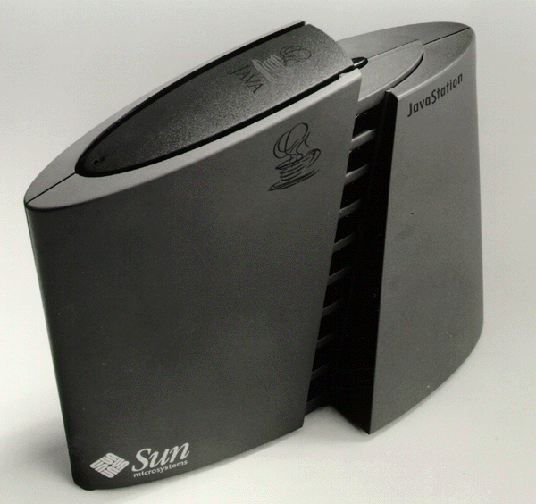
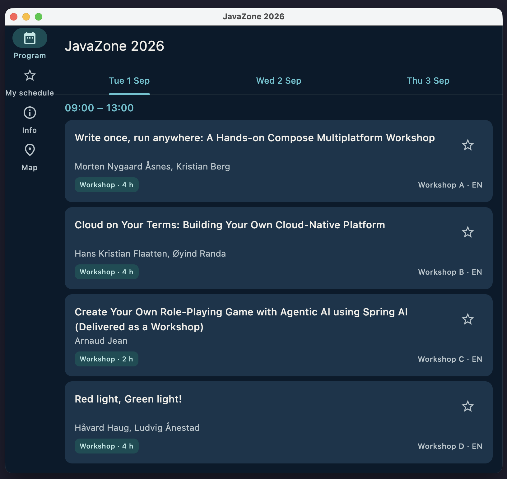
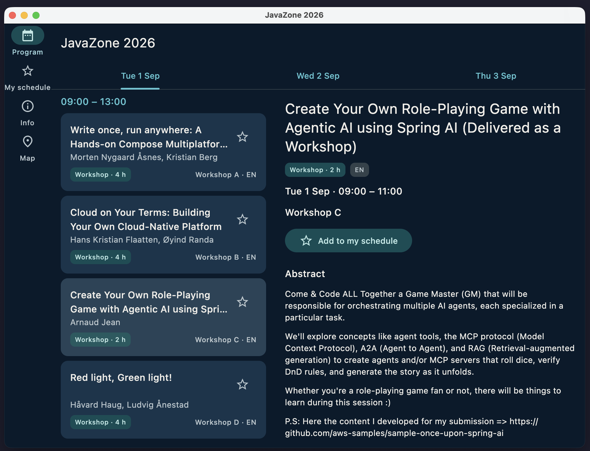

autoscale: true
slide-transition: fade(0.3)

# Practical Multiplatform Development
## with Compose and Kotlin


### JavaZone 2026 workshop

### Morten Nygaard Åsnes · Kristian Berg

^ Today: build a real conference app — *this* JavaZone's schedule — one Kotlin codebase, four platforms

^ You write the UI, state layer and data layer yourself; repo doubles as a reusable template 

^ While people settle: cloned + verifySetup? If not — start the Gradle sync NOW

---

# About us

- **Morten Nygaard Åsnes** — Senior Consultant at Miles. Java and Kotlin ecosystem veteran, early adopter of Kotlin Multiplatform.
- **Kristian Berg** — Tech Lead, platform team at KS Digital. Two decades of Java, Kotlin for the last few years. javaBin Bergen since 2004, former javaBin board member.

^ - One minute each

^ - Morten: early KMP/CMP adopter — followed Java from the start, early adapter of kotlin

^ - Kristian: the Java perspective — 20 years of Java, knows what feels foreign vs. like home to a Java dev

---

# Plan for today

| Time | Block |
| :--- | :--- |
| 30 min | **0 — Kickoff & setup** |
| 90 min | **1 — Building the UI with Compose** |
| 45 min | **2 — State & architecture** |
| 45 min | **3 — Shared logic & data** |
| 30 min | **4 — Advanced DX & wrap-up** |

^ - We will switch back and forth between theory and practical tasks

^ - Block 1 is the larges with 90 minutes.

^ - May adjust as we go based on progress

^ - Checkpoint to check out for each task

^ - Take breakes during the work sessions, coffee and snacks available

^ - Food after workshop?

---

# Practical

- Workshop repo:<br>`https://github.com/mortenaa/javazone-cmp-workshop`
- Wifi: `<WIFI-NETWORK>` / password `<WIFI-PASSWORD>`
- Each task **starts from the previous checkpoint**:

```
git checkout checkpoint-2        # → start task 3
```

- Task descriptions live in the repo under `docs/tasks/`

^ - Hopefully already cloned and done setup, if not start now

^ - Checkpoint model: checkpoint-N = code after task N; each task starts from the previous one — commit your work, check out, go

^ - Doubles as the safety net; checkpoint-6 = complete app

^ - Even if you finish one task, the next might require some provided code from the checkpoint, so always start from that

^ - Task docs: collapsible hints, 1. points in right direction, 2. gives signatures, 3. gives the code

^ - Stuck, use the hints, there is a lot to get through

^ - Broken env: IDE "Preflight Checks" tool window (double-Shift → "preflight"), or kdoctor; SETUP.md §4

---

# Block 0
## Why multiplatform?

## the why, the how, and **Task 0**

^ - Why does this tech exist at all? The problem is older than most frameworks

^ - This being JavaZone: the story starts with Java

---

# Write once, run anywhere.

^ - Sun, 1995: JVM abstracts the hardware 

^ - One codebase to run on all platforms without change

---



^ - Java ran everywhere: Blu-ray players, SIM cards, "3 billion devices"

^ - Success on servers, but client-side WORA never took over: applets died, Swing never felt native

^ - Smartphones brought the client problem back

---

# The problem

- We write the same app **twice**
  - Android: Kotlin, Jetpack Compose
  - iOS: Swift, SwiftUI
- Two teams, two build systems, two release and deploy
- Duplicated models, logic, tests — and duplicated bugs
- Features drift apart between platforms

^ - Every feature: specified once, implemented twice, by people who can't review each other's code

^ - Identical logic, two languages — when the apps disagree, users notice

^ - Want: WORA back, *including UI*, without losing native performance/integration

---

# The competition

- **React Native** — JavaScript, native widgets via a bridge
- **Flutter** — Dart, custom rendering engine
- **.NET MAUI** — C#, the Xamarin lineage
- **Cordova / Ionic / PWA** — the web-view family

^ - Serious contenders: React Native (JS ecosystem, native widgets), Flutter (great tooling, own engine)

^ - new language + new ecosystem for the team

^ - CMP: we already write Kotlin — keep language, IDE, libraries, testing habits

^ - Familiar if Android experience

^ - Share as much or as little as we want between platforms

---

# How we got here

- **2016** — Kotlin 1.0
- **2017** — Kotlin/Native; official Android support; first "multiplatform projects" (Kotlin 1.2)
- **2019** — Kotlin becomes Google's preferred language for Android / Jetpack Compose preview
- **2021** — Compose Multiplatform 1.0 (Desktop)
- **2023** — Kotlin Multiplatform declared **stable**
- **2025** — Compose Multiplatform **stable on iOS**

^ - Foundation laid with Kotlin/Native, compile kotlin to native code or js

^ - Multiplatform projects - sharing code across platforms

^ - Android started moving to Jetpack Compose

^ - Multiplatform + Compose = Compose Multiplatform, 100% kotlin with ui possible

^ - Stable on most platforms

---

# Kotlin Multiplatform (KMP)

- Share Kotlin code between Android, iOS, Desktop, Web and servers
- You choose **what** to share: models, logic, networking… or everything
- Mix in platform code where needed — `expect` / `actual`
- Full access to platform APIs from platform source sets

^ - Not a VM, not a bridge: common Kotlin compiled natively per target

^ - Key design decision: sharing is opt-in and gradual — one function or the whole app

^ - Native code never more than one source set away

^ - expect/actual comes properly in Block 3, where we genuinely need it (storage)

---

# Kotlin/Native

- Compiles Kotlin to **native binaries** — no JVM at runtime
- LLVM-based compiler backend
- Targets: iOS, macOS, Linux, Windows, watchOS, tvOS
- Automatic memory management with a modern GC
- Two-way interop with Objective-C/Swift

^ - This is what makes iOS possible: Kotlin → regular Apple framework, linked like any other

^ - No VM inside the iOS app; Kotlin's own GC manages memory

^ - ObjC interop: call any iOS API directly from iosMain

---

# Compose Multiplatform (CMP)

- The **UI layer**: JetBrains' multiplatform distribution of Jetpack Compose
- Declarative, reactive UI in pure Kotlin
- Material 3 components included
- One `@Composable` tree runs on all four targets

^ - Completes the picture: KMP alone still means writing SwiftUI for iOS

^ - Jetpack Compose (already won on Android) running everywhere — same API, same mental model, same code

^ - Never seen Compose? UI = functions of data; data changes → affected parts recompose. That's all of Block 1

---

# How it renders

| Platform | Rendering                                       |
| :--- |:------------------------------------------------|
| Android | Jetpack Compose — the native Android UI toolkit |
| iOS | Skia via Metal, into a native `UIView`          |
| Desktop (JVM) | Skia in a window                                |
| Web | Skia to a `<canvas>`, via WebAssembly           |

^ - Android: CMP simply *is* Jetpack Compose — nothing emulated

^ - Everywhere else: Skia (same engine as Chrome and Flutter)

^ - iOS trade-off, make it consciously: pixel-parity with Android, not SwiftUI widgets

^ - Accessibility is supported through accessability apis on the target platform

^ - Web: Kotlin→Wasm painting a canvas; youngest target (1.11 reworked touch/scroll), replacing JS target

---

# Current state — mid-2026 (1/2)

## Kotlin Multiplatform

| Platform | Stability |
| :--- | :--- |
| Android, iOS, Desktop (JVM), Server-side (JVM) | **Stable** |
| Web — Kotlin/JS | **Stable** |
| Web — Kotlin/Wasm | Beta |
| watchOS, tvOS | Beta |

^ - Verified against kotlinlang.org, July 2026

^ - Today's core targets all stable

^ - Wasm Beta = JetBrains' "ready for early adopters, minimal breaking changes expected"

^ - We target it anyway — you'll see it mostly Just Works

---

# Current state — mid-2026 (2/2)

## Compose Multiplatform

| Platform | Stability |
| :--- | :--- |
| Android, iOS, Desktop (JVM) | **Stable** |
| Web (Kotlin/Wasm) | Beta |

- New since 2025: common `@Preview`, Navigation 3 support, **stable bundled Hot Reload**, iOS native text input

^ - Stable on major platforms

^ - Brings native ios text input, scrolling and animation, and accessibility

^ - Webasm in beta

---

# Degrees of sharing

- **Share logic only** — ViewModels, repositories, networking, models
  Native UI: Jetpack Compose on Android, SwiftUI on iOS
- **Share logic + UI** — everything in Kotlin
- **Hybrid** — shared Compose UI, native components embedded where needed (maps, web views, camera)

^ - You don't have to go all-in

^ - Today: shared everything

^ - Shared Compose is usually good enough

---

# What we build today


## **JavaZone 2026** — the conference app

- Program with day tabs, filters, search
- Session details, speakers
- My schedule (favorites, persisted)
- Adaptive: phone, tablet, desktop, browser
- Live data via Ktor, offline fallback

^ - Screenshot = the finished app: desktop dark theme + phone

^ - Actually useful: real 2026 program, 156 sessions, search, persisted personal schedule

^ - Every task builds a slice; complete source = checkpoint-6

---

# Project structure

```
composeApp/
  src/
    commonMain/      shared logic (KMP) + shared UI (CMP)
    androidMain/     Android-specific code
    iosMain/         iOS-specific code
    jvmMain/         Desktop-specific code
    wasmJsMain/      Web-specific code
  build.gradle.kts
iosApp/              Xcode wrapper project
```

^ - One Gradle module, five source sets; almost everything today → commonMain (that's the point)

^ - Platform sets = thin edges: entry points + storage drivers (Block 3)

^ - iosApp: small Xcode wrapper, only opened to run on device/simulator

^ - commonMain can't see platform APIs — compiler-enforced

---

# Heads-up: new projects look different (AGP 9)

**New projects (AGP 9+)** — the Android app moves out:

```
androidApp/     
desktopApp/
webApp/
iosApp/
shared/
  src/
    androidMain/
    commonMain/
    iosMain/
    jvmMain/
    wasmJsMain/
```

^ - a fresh KMP-wizard project on AGP 9 won't match today's layout

^ - thin application wrappers for each platform like ios had

^ - instead of single module

^ - all code added in shared module

^ - commonMain for common code, and platform specific source sets

---

# One `build.gradle.kts` declares all targets

`composeApp/build.gradle.kts`

```kotlin
kotlin {
    // JDK 21 toolchain (auto-provisioned via foojay): matches the JetBrains Runtime
    // that Compose Hot Reload runs the desktop app on.
    jvmToolchain(21)

    androidTarget { /* ... */ }

    iosArm64()
    iosSimulatorArm64()

    jvm()

    @OptIn(ExperimentalWasmDsl::class)
    wasmJs { /* ...browser { }, binaries.executable()... */ }
    // ...
}
```

^ - Real build file, trimmed; one kotlin {} block = every target

^ - jvmToolchain(21): Hot Reload requirement, introduced in Block 4 — why setup downloaded a toolchain

^ - Dependencies are per source set → next slide

---

# Dependencies per source set

`composeApp/build.gradle.kts`

```kotlin
sourceSets {
    commonMain.dependencies {
        implementation(compose.material3)
        implementation(libs.androidx.navigation.compose)
        implementation(libs.ktor.client.core)
        implementation(libs.sqldelight.runtime)
        // ...
    }
    androidMain.dependencies {
        implementation(libs.ktor.client.okhttp)
        implementation(libs.sqldelight.android.driver)
        // ...
    }
    iosMain.dependencies {
        implementation(libs.ktor.client.darwin)
        implementation(libs.sqldelight.native.driver)
    }
    // ...jvmMain, wasmJsMain follow the same pattern...
}
```

^ - common = platform-neutral API artifacts; each platform adds its implementation (HTTP engine, DB driver)

^ - Common code never knows which engine it got

^ - Same principle in the Ktor and SQLDelight tasks

---

# Versions: `gradle/libs.versions.toml`

```toml
[versions]
kotlin = "2.4.0"
composeMultiplatform = "1.11.1"
ktor = "3.5.1"
sqldelight = "2.3.2"
androidxNavigation = "2.9.2"
# ...

[libraries]
ktor-client-core = { module = "io.ktor:ktor-client-core", version.ref = "ktor" }
ktor-client-okhttp = { module = "io.ktor:ktor-client-okhttp", version.ref = "ktor" }
ktor-client-darwin = { module = "io.ktor:ktor-client-darwin", version.ref = "ktor" }
ktor-client-js = { module = "io.ktor:ktor-client-js", version.ref = "ktor" }
```

^ - One file has every version, the `libs.` references in the build files resolve here

^ - one shared `version.ref` for core + all three platform engines together, one common api + platform engines

^ - Keep these exact versions locked

---

# One `App()`, four hosts

```kotlin
// jvmMain — main.kt
fun main() = application {
    Window(onCloseRequest = ::exitApplication, title = "JavaZone 2026") {
        App()
    }
}

// iosMain — MainViewController.kt
fun MainViewController() = ComposeUIViewController { App() }

// wasmJsMain — main.kt
fun main() {
    ComposeViewport(document.body!!) {
        App()
    }
}
```

^ - Entry points on each platform calles the common App()

^ - Everything below App() is shared

^ - Compilation: Android → JVM bytecode; iOS → native framework (LLVM); desktop → jars; web → .wasm + JS glue

---

# Task 0 — Run it

## fresh clone → `main` runs


**Goal:** Get the starter app running on at least one target on your machine.

1. `./gradlew :composeApp:run` — desktop first, it's the fastest
2. Run on the Android emulator from the IDE
3. Mac users: run the iOS app via the `iosApp` run configuration
4. Web: `./gradlew :composeApp:wasmJsBrowserDevelopmentRun`
5. Open `src/` and find the five source sets

^ - Desktop first: fastest loop, no emulator — our default target all day

^ - Windows/Linux: no iOS — Android + desktop + web

^ - While builds run: do step 5, find commonMain and App.kt

^ - Potential problems: SDK licenses, no emulator image, missing Xcode CLT, corporate proxy — task doc has troubleshooting

---

# Block 1
## Building the UI with Compose

### 90 min — fundamentals · layouts · adaptive UI · Tasks 1–3

^ - The biggest block, a little theory, then task 1 - 3

^ - End of block: looks like a real app on every screen size

---

# UI as functions

`…/ui/components/States.kt`

```kotlin
@Composable
fun LoadingState(modifier: Modifier = Modifier) {
    Column(
        modifier = modifier.fillMaxSize(),
        horizontalAlignment = Alignment.CenterHorizontally,
        verticalArrangement = Arrangement.Center,
    ) {
        CircularProgressIndicator()
        Text(
            text = "Loading program…",
            style = MaterialTheme.typography.bodyMedium,
            color = MaterialTheme.colorScheme.onSurfaceVariant,
            modifier = Modifier.padding(top = 16.dp),
        )
    }
}
```
^ - Real screen state, already in the starter (ui/components/States.kt); wired up in Block 2

^ - @Composable is a function that *emits* UI, no view objects returned; functions composing functions

^ - PascalCase naming of composable function

^ - trailing `modifier: Modifier = Modifier` — The convention; common for every custom component, at the root element

---

# Composition & recomposition

- Running a `@Composable` builds the **composition** — a tree of UI nodes
- Composables that **read state** are subscribed to it
- State changes → only the readers re-execute: **recomposition**
- Your functions may run *often* and *in any order*
  keep them fast and side-effect free

^ - You never update the UI — you update state; framework re-runs the readers

^ - functions of inputs — no network calls, no global mutation in composition

^ - analogy: spreadsheet cell recalculating

---

# Layout: `Column`, `Row`, `Box`

`…/ui/detail/SpeakerRow.kt`

```kotlin
Row(horizontalArrangement = Arrangement.spacedBy(12.dp)) {
    Surface(
        shape = CircleShape,
        color = MaterialTheme.colorScheme.primaryContainer,
        modifier = Modifier.size(40.dp),
    ) {
        Box(Modifier.fillMaxSize(), contentAlignment = Alignment.Center) {
            Text(speaker.name.initials(), style = MaterialTheme.typography.titleMedium)
        }
    }
    Column(Modifier.weight(1f)) {
        Text(speaker.name, style = MaterialTheme.typography.titleSmall)
        // ...bio text and social-link chips...
    }
}
```

^ - The three primitives: Column stacks, Row lines up, Box overlays/centers

^ - weight(1f): avatar keeps its 40 dp, text column takes the rest, if multiple children distribute according to weight

^ - No XML, no constraint language — layout is nesting + parameters

---

# Modifiers — and why order matters

```kotlin
// SessionDetailScreen.kt — pad first, then fill, then scroll:
Box(Modifier.padding(padding).fillMaxSize().verticalScroll(rememberScrollState()))

// EmptyState.kt — top margin, then a width cap:
modifier = Modifier.padding(top = 8.dp).widthIn(max = 320.dp)

// TimeSlotHeader.kt — layout first, then semantics:
modifier = Modifier
    .padding(vertical = 8.dp)
    .semantics { heading() }
```

^ - Crucial rule: the chain applies IN ORDER, outside-in — padding→background ≠ background→padding

^ - Layout looks wrong today? Check modifier order first

---

# Material 3 - Standard UI components

- `Scaffold`, `TopAppBar`, `NavigationBar`, `NavigationRail`
- `Card`, `Surface`, `Text`, `Icon`, `IconButton`
- `PrimaryTabRow`, `FilterChip`, `AssistChip`, `Badge`
- `FilledTonalButton`, `CircularProgressIndicator`
- All themed by `MaterialTheme` — colors, typography, shapes

^ - Google design language

^ - Stock components = free ripple, focus rings, keyboard nav, screen-reader support on every platform

---

# Theming: the JavaZone palette

`…/ui/theme/Theme.kt`

```kotlin
private val DarkColors = darkColorScheme(
    primary = Color(0xFF57C4D1),            
    tertiary = Color(0xFFF2C14E),           
    background = Color(0xFF071A2B),        
    // ...
)

@Composable
fun JavaZoneTheme(
    darkTheme: Boolean = isSystemInDarkTheme(),
    content: @Composable () -> Unit,
) {
    MaterialTheme(
        colorScheme = if (darkTheme) DarkColors else LightColors,
        content = content,
    )
}
```

^ - M3 theme = just data: two color schemes + typography/shape defaults

^ - Theme as custom composable, wraps the content `content: @Composable () -> Unit` — slot API pattern

---

# Local state: `remember` + `mutableStateOf`

```kotlin
// MapScreen.kt — state that survives recomposition:
val transform = remember { MapTransform() }
var selectedMarker by remember { mutableStateOf<VenueMarker?>(null) }

// ProgramScreen.kt — keyed remember: recompute only when `state` changes
val slots = remember(state) { state.daySlots(state.selectedDay) }
```

- `mutableStateOf` — an observable value
- `remember` — caches across recompositions
- `remember(key)` — recomputes when the key changes

^ - remember = survives recomposition (without it, fresh object every re-run) cached value

^ - keyed, memoization: remember, but recompute when state changes

^ - mutableStateOf = observable holder, write triggers recomposition

^ - `by` = sugar for .value

^ - often combined, remember cashes value, mutableStateOf makes it observable

---

# Previews

`…/ui/components/SessionCard.kt`

```kotlin
import androidx.compose.ui.tooling.preview.Preview

@Preview
@Composable
private fun SessionCardPreview() {
    JavaZoneTheme(darkTheme = false) {
        SessionCard(sampleSession, isFavorite = true, onClick = {}, onToggleFavorite = {})
    }
}

@Preview
@Composable
private fun SessionCardPreviewDark() {
    JavaZoneTheme(darkTheme = true) {
        SessionCard(sampleSession, isFavorite = false, onClick = {}, onToggleFavorite = {})
    }
}
```

^ - Render in the IDE, nothing launches; theme wrapper + fixture data (sampleSession in starter), light + dark side by side

^ - Common @Preview in commonMain since CMP 1.10

^ - Import: the androidx one, and it's correct here (starter uses org.jetbrains.compose.ui:ui-tooling-preview → androidx name on all targets)

^ - older artifact needed the org.jetbrains name; mixing broke iOS/wasm

^ - Previews are static, for interactive = desktop + Hot Reload (Block 4)

^ - Task 1 workflow: build the card while using the preview to show it in Ide

---

# Task 1 — `SessionCard`

## Start from `main`, compare with `checkpoint-1`


**Goal:** build the composable that renders one session in the list.

1. Create `SessionCard.kt` in `ui/components/`
2. `Card` with `onClick`; inside: a `Column` of title, speakers, metadata
3. Title: `titleMedium`, `maxLines = 2`, ellipsis; star `IconButton` to the right
4. Add the `FormatBadge` sub-composable (colored `Surface` + label)
5. `@Preview` it with `sampleSession` — light *and* dark

^ - First composable, most reused component in the app

^ - Task doc = full spec: typography roles, format colors, a11y (star contentDescription includes the title)

^ - try before opening hints, but use hints when stuck! 1 - nudge, 2 - signatures, 3 - code

^ - core card ~15 min; FormatBadge = the stretch; racing ahead → add the `selected` param (Task 3 uses it)

^ - Compare with checkpoint-1 when done

---

# Slot APIs

`…/ui/program/ProgramScreen.kt`

```kotlin
Scaffold(
    topBar = {
        TopAppBar(
            title = {
                if (searchActive) {
                    SearchField(/* ... */)
                } else {
                    Text("JavaZone 2026")
                }
            },
            actions = { /* ...search and refresh IconButtons... */ },
        )
    },
) { padding ->
    Column(Modifier.padding(padding)) { /* ...the screen... */ }
}
```

^ - Slots = a parameter that is a piece of UI instead of data, composable lambda parameters, filled with anything

^ - Signature, @Composable () -> Unit

^ - Here: our screen can switch the whole title area between text and a search field

^ - Same as JavaZoneTheme's `content`

^ - Scaffold has several slots, here we use topBar and content (the body)

---

# Lazy lists + sticky headers

`…/ui/components/SessionList.kt`

```kotlin
LazyColumn(
    modifier = modifier,
    contentPadding = PaddingValues(start = 16.dp, end = 16.dp, bottom = 24.dp),
) {
    slots.forEach { slot ->
        stickyHeader(key = "header-${slot.start}") {
            TimeSlotHeader(slot.start, slot.end)
        }
        items(slot.sessions, key = { it.id }) { session ->
            SessionCard(
                session = session,
                isFavorite = session.id in favoriteIds,
                onClick = { onSessionClick(session.id) },
                onToggleFavorite = { onToggleFavorite(session.id) },
                // ...
            )
        }
    }
}
```
^ - To show a large list of items, to avoid composing every item

^ - LazyColumn = Compose's RecyclerView: only visible items composed — 156 sessions smooth even on web

^ - takes item *descriptions*, need a stable key for each item so Compose can track changed items

^ - stickyHeader and items are builders, we loop through, and for each slot we set the header, and the items

^ - stickyHeader pins the time headers while their group scrolls

^ - Needs to be inside a component with defined height!

---

# Task 2 — Program list

## Start from `checkpoint-1`, compare with `checkpoint-2`


**Goal:** a scrollable, day-tabbed program of all 156 sessions from the bundled JSON.

Four composables, bottom-up — each runnable on its own:

1. `TimeSlotHeader` — the "10:20 – 11:20" heading (`timeRangeLabel()` provided)
2. `SessionList` — `LazyColumn` of `SessionCard`s, `stickyHeader` per slot
3. `DayTabRow` — `PrimaryTabRow`, one tab per day: Tue / Wed / Thu
4. `ProgramScreen` — `Scaffold` + `TopAppBar`, tabs over the selected day's list
   (or `EmptyState`); then `App()` calls it

^ - loading is already in App.kt, toConferenceDays() does the grouping of sessions by slot

^ - Selected day = plain `remember` for now

^ - the EmptyState wont show now because every day has sessions; its usefull when we filter or show favorites

---

# One codebase, every window size

| Width class | Width | Navigation | Program           |
| :--- | :--- | :--- |:------------------|
| **Compact** | < 600 dp | `NavigationBar` (bottom) | single pane       |
| **Medium** | 600–839 dp | `NavigationRail` (left) | single pane       |
| **Expanded** | ≥ 840 dp | `NavigationRail` (left) | **list + detail** |

^ - Targeting all platforms from one codebase would look bad if the web version had to look the same as the phone

^ - Layouts are flexible and we can decide which parts grow with resize like we saw with the weight parameter

^ - But sometimes we need to have different design based on size and orientation.

^ - Size classes for width and height, we use just width for simplicity here

^ - Desktop resize crosses all layouts columns of this table live

---

# Compact · < 600 dp


^ - Bottom `NavigationBar`, one pane, the phone layout

^ - `ListDetailLayout` renders `list()` only, we will add detail view for this layou in task 4

---

# Medium · 600–839 dp



^ - First breakpoint: navigation moved to a left `NavigationRail`

^ - Still one pane

^ - Fits phone in landscape, or small tablet

---

# Expanded · ≥ 840 dp



^ - Second breakpoint: `ListDetailLayout` switches to the weighted Row, 0.42 / 0.58

^ - Detail is now *state*, not a destination — the selected card highlights in the list

^ - The rail didn't change; only the panes did

^ - Everything below the scaffold is the same code as the compact slide

---

# Reading the window size

`…/ui/AdaptiveScaffold.kt`

```kotlin
/** Width class, decisions are made on width only. */
enum class WindowWidth { Compact, Medium, Expanded }

@Composable
fun currentWindowWidth(): WindowWidth {
    val sizeClass = currentWindowAdaptiveInfo().windowSizeClass
    return when {
        sizeClass.isWidthAtLeastBreakpoint(WindowSizeClass.WIDTH_DP_EXPANDED_LOWER_BOUND) ->
            WindowWidth.Expanded
        sizeClass.isWidthAtLeastBreakpoint(WindowSizeClass.WIDTH_DP_MEDIUM_LOWER_BOUND) ->
            WindowWidth.Medium
        else -> WindowWidth.Compact
    }
}
```

^ - material3-adaptive, multiplatform, identical on all four targets

^ - itself a Composable, so tracks the live window as its resized and recomposes

^ - adaptive layout is just state

---

# `AdaptiveScaffold`: bar or rail

`…/ui/AdaptiveScaffold.kt`

```kotlin
@Composable
fun AdaptiveScaffold(
    windowWidth: WindowWidth,
    currentRoute: String?, onNavigate: (String) -> Unit,   // selected tab, tab clicks
    content: @Composable () -> Unit,        // what we wrap — identical in both branches
) {
    if (windowWidth == WindowWidth.Compact) {
        Scaffold(bottomBar = {
            NavigationBar {
                TopDestination.entries.forEach { NavigationBarItem(/* ... */) }
            }
        }) { padding ->
            Box(Modifier.padding(padding)) { content() }
        }
    } else {
        Row(Modifier.fillMaxSize()) {
            NavigationRail {
                TopDestination.entries.forEach { NavigationRailItem(/* ... */) }
            }
            Box(Modifier.weight(1f)) { content() }
        }
    }
}
```

Bar goes **under** the content → a `Scaffold` slot · rail goes **beside** it → just a `Row`

^ - `content` is a slot — AdaptiveScaffold never knows what's inside it, only where to put the navigation.

^ - No navigation library yet: `currentRoute` is just a String naming the selected tab, held in a plain `remember` in App.kt. Task 4 swaps it for the NavHost back stack

^ - `TopDestination` is the small enum they write in step 2

^ - Bottom bar sits under the content, and Scaffold has a slot for exactly that

^ - Rail sits beside it — no special component needed, a Row does it

^ - That's why the two branches look different; the *items* are identical, both from TopDestination.entries

---

# `ListDetailLayout`: one pane or two

`…/ui/components/ListDetailLayout.kt`

```kotlin
@Composable
fun ListDetailLayout(
    expanded: Boolean,
    list: @Composable () -> Unit,           // the session list
    detail: @Composable () -> Unit,         // the selected session
) {
    if (expanded) {
        Row(Modifier.fillMaxSize()) {
            Box(Modifier.weight(0.42f)) { list() }      // ~40% of the width …
            Box(Modifier.weight(0.58f)) { detail() }    // … the other ~60%
        }
    } else {
        list()          // one pane only — the detail gets its own screen (Task 4)
    }
}
```

^ - Two slots and one `if` — the entire two-pane implementation

^ - Wide: both slots render side by side in a weighted Row

^ - Narrow: only `list()` is called; `detail` is never composed

^ - So on big screens "detail" is *state*, on small screens it's a *place you go* - we get to that later

^ - (material3-adaptive has a fancier ListDetailPaneScaffold)

---

# The screen fills the slots

`…/ui/program/ProgramScreen.kt`

```kotlin
var selectedSessionId by remember { mutableStateOf<String?>(null) }

ListDetailLayout(
    expanded = expanded,
    list = {
        SessionList(
            slots = slots,
            onSessionClick = { selectedSessionId = it },
            selectedSessionId = if (expanded) selectedSessionId else null,
            // ...
        )
    },
    detail = {
        val session = sessions.firstOrNull { it.id == selectedSessionId }
        if (session == null) EmptyState(icon, "Select a session", "…")
        else SessionDetailContent(session, /* ... */)
    },
)
```

^ - The screen owns the selection; the layout only decides where things go

^ - One tap sets `selectedSessionId` — on a wide window that fills the right-hand pane immediately

^ - Highlight is suppressed when not expanded: no pane on screen, so a highlighted card would explain nothing

^ - Which is why on a narrow window in Task 3 a tap looks like it does nothing — the route that shows the detail arrives in Task 4

^ - The null branch is why `EmptyState` has a "Select a session" case: the pane exists before anything is chosen

---

# Task 3 — Adaptive layout

## Start from `checkpoint-2`, compare with `checkpoint-3`


**Goal:** bottom bar on the phone, rail + two panes on desktop — same code.

1. Add `currentWindowWidth()` using `currentWindowAdaptiveInfo()`
2. Build `AdaptiveScaffold`: `NavigationBar` when compact, `NavigationRail` otherwise
3. Add `ListDetailLayout` and use it on the Program screen
4. Track `selectedSessionId`; highlight the selected card (`selected` param!)
5. Run on desktop **and** the phone/emulator, try to resize the desktop window

---

# [fit] Block 2
# [fit] State & architecture

### 45 min — hoisting · UDF · MVVM vs MVI · navigation · Task 4

^ - Unidirectional Data Flow, Model View ViewModel, Model View Intent

^ - Block 1 left state scattered in `remember` blocks

^ - Move it somewhere testable, shareable, rotation-proof, better architecture

---

# State hoisting

`…/ui/components/SessionCard.kt`

```kotlin
@Composable
fun SessionCard(
    session: Session,          // state flows DOWN
    isFavorite: Boolean,       // state flows DOWN
    onClick: () -> Unit,               // events flow UP
    onToggleFavorite: () -> Unit,      // events flow UP
    selected: Boolean = false,
    modifier: Modifier = Modifier,
) { /* ... */ }
```

- The card **owns no state** — it renders inputs and reports events
- Stateless components: previewable, reusable, testable

^ - They already did this in Task 1: the card is *told* isFavorite, reports taps up

^ - Hoisting = lift state to the lowest common owner; values down, events up

^ - A component that is stateless is easy to test and to reuse

---

# Unidirectional data flow

```
        ┌──────────────┐
        │   UiState    │
        └──────┬───────┘
     state     │      ▲     events
     flows     ▼      │     flow
        ┌──────────────┐
        │      UI      │
        └──────────────┘
```

- One owner of truth; UI renders state, emits events
- Events produce a **new** state; UI recomposes
- No `view.setText(...)`

^ - Hoist all the way up → the loop: state down, events up, new state, recompose

^ - Every modern UI architecture looks something like this

^ - debuggability: UI wrong ⇒ state wrong ⇒ exactly one writer to check

^ - Contrast: the two-way data-binding spaghetti some of us remember

---

# MVVM vs MVI

|          | MVVM                          | MVI |
|:---------|:------------------------------| :--- |
| State    | several observable properties | **one** immutable state object |
| Input    | one method per action         | **one** sealed intent type |
| Updates  | ad hoc, anywhere              | pure reducer function |
| Ceremony | low                           | higher |
| Pros     | familiar, quick               | log/replay/test every action |

^ - MVVM: observable state + public methods; MVI: intent values → one entry point → reducer → next immutable state

^ - MVI buys a single point for mutation (log intents = replayable session) 

^ - We go for a hybrid for simplicity, One state object, one sealed list of intent/things the user can do, one entry point
and then we just update the state directly instead of building a reducer pipeline

---

# Our choice: MVVM with MVI-flavored intents

`…/ui/program/ProgramIntent.kt`

```kotlin
/** Everything the user can do on the program screens, as data (MVI-flavored MVVM). */
sealed interface ProgramIntent {
    data class SelectDay(val day: LocalDate) : ProgramIntent
    data class ToggleFormat(val format: Format) : ProgramIntent
    data class ToggleLanguage(val language: String) : ProgramIntent
    data class Search(val query: String) : ProgramIntent
    data object ClearFilters : ProgramIntent
    data class ToggleFavorite(val sessionId: String) : ProgramIntent
    data class SelectSession(val sessionId: String?) : ProgramIntent
    data object DismissOfflineBanner : ProgramIntent
    data object Retry : ProgramIntent
}
```

^ - Complete file: nine things a user can do, as data — the entire user-facing API of the feature

^ - Screens get ONE onIntent lambda instead of nine callbacks

^ - Why hybrid: plain VM + `when`, no reducer pipeline/middleware 

---

# One immutable `UiState`

`…/ui/program/ProgramUiState.kt`

```kotlin
/** Single immutable snapshot of everything the program screens render. */
data class ProgramUiState(
    val isLoading: Boolean = true,
    val loadFailed: Boolean = false,
    val isOffline: Boolean = false,
    val sessions: List<Session> = emptyList(),
    val favoriteIds: Set<String> = emptySet(),
    val selectedDay: LocalDate? = null,
    val activeFormats: Set<Format> = emptySet(),
    val activeLanguages: Set<String> = emptySet(),
    val searchQuery: String = "",
    val selectedSessionId: String? = null,
    // ...
) {
    val showOfflineBanner: Boolean get() = isOffline && !offlineBannerDismissed

    /** The selected day's slots with format/language filters applied (Program tab). */
    fun daySlots(day: LocalDate?): List<TimeSlot> =
        sessions.filter { it.matchesFilters() }.slotsFor(day)
}
```

^ - One data class holds everything the program screens render — no state scattered across composables

^ - Immutable: every change swaps in a whole new object, so the UI can never catch it mid-update

^ - It's just data — hand any snapshot to a preview or a test, no ViewModel or coroutines needed

^ - Defaults describe the initial state

---

# The ViewModel: `StateFlow` in commonMain

`…/ui/program/ProgramViewModel.kt`

```kotlin
/** Owns the program data and favorites; the UI only sends [ProgramIntent]s. */
class ProgramViewModel(
    private val repository: ProgramRepository = ProgramRepository(),
) : ViewModel() {

    private val _state = MutableStateFlow(ProgramUiState())
    val state: StateFlow<ProgramUiState> = _state.asStateFlow()

    init {
        loadProgram()
        viewModelScope.launch {
            repository.favoriteIds.collect { ids ->
                _state.update { it.copy(favoriteIds = ids) }
            }
        }
    }
    // ...
}
```

^ - Yes, androidx.lifecycle.ViewModel — in common code, on iOS and in a browser (JetBrains multiplatform builds; Android idioms transfer wholesale)

^ - private MutableStateFlow / public StateFlow: only the VM writes

^ - viewModelScope: tied to VM lifetime, cancels in-flight work

^ - init subscribes to the favorites Flow — reactive once Block 3 plugs in real storage

^ - Constructor default = manual DI; no framework today, often none needed

---

# Handling intents

`…/ui/program/ProgramViewModel.kt`

```kotlin
fun onIntent(intent: ProgramIntent) {
    when (intent) {
        is ProgramIntent.SelectDay ->
            _state.update { it.copy(selectedDay = intent.day) }
        is ProgramIntent.Search ->
            _state.update { it.copy(searchQuery = intent.query) }
        is ProgramIntent.ToggleFavorite ->
            viewModelScope.launch { repository.toggleFavorite(intent.sessionId) }
        is ProgramIntent.SelectSession ->
            _state.update { it.copy(selectedSessionId = intent.sessionId) }
        ProgramIntent.Retry -> loadProgram()
        // ...ToggleFormat, ToggleLanguage, ClearFilters, DismissOfflineBanner...
    }
}
```

^ - Single entry point; most intents = one-line copy(); update{} = atomic compare-and-set

^ - Sealed `when` is exhaustive — forgotten branch won't compile

^ - Departure from pure MVI: ToggleFavorite doesn't touch state — repository call, new favorites arrive via the Flow

^ - State follows storage: UI can't show a favorite that failed to persist; strict reducer would need an effects system, this is six lines

---

# Collecting state in the UI

`App.kt`

```kotlin
val viewModel: ProgramViewModel = viewModel { ProgramViewModel() }
val state by viewModel.state.collectAsState()
```

- `viewModel { }` — creates/retains it across recompositions & config changes
- `collectAsState()` — StateFlow → Compose state: every emission recomposes readers

^ - Two lines close the loop: viewModel{} = scoped retention (survives config changes on Android); collectAsState = StateFlow → Compose state

^ - Android nuance: collectAsStateWithLifecycle pauses collection in background — use it in Android-only work

^ - Here: plain collectAsState keeps common code simple; negligible for one small StateFlow

^ - If asked where state belongs: screen-local UI state (is the search field open?) → `remember`/`rememberSaveable` in the composable; anything shared, derived or business-relevant → the ViewModel

---

# Navigation

- **Route** — a `String` naming a screen: `"program"`, `"session/42"`
- **Destination** — the composable shown for a route
- **Back stack** — the history: `navigate()` pushes, back pops
- **`NavController`** — owns the back stack; survives recomposition *and* process death
- **`NavHost`** — renders whichever destination is on top

State hoisting again: the controller *holds* it, the `NavHost` *reads* it

^ - They already met "route" in Task 3 — a String naming a tab. Same idea, now it can name any screen and carry arguments

^ - Nobody tells the NavHost to switch screens: you change the back stack, it recomposes. Same loop as the rest of this block

^ - The back stack is why back and Esc work for free — and why the web target gets sensible browser history

^ - navigation-compose is multiplatform: the same API on all four targets

---

# Navigation, in code

```kotlin
val navController = rememberNavController()   // owns the back stack

NavHost(navController, startDestination = "program") {
    composable("program") { ProgramScreen(/* ... */) }    // one entry per destination
    composable("session/{sessionId}") { /* ... */ }       // {…} marks an argument
}

navController.navigate("session/42")   // push
navController.navigateUp()             // pop
```

A route is just a string · the `NavHost` renders exactly one destination at a time

^ - The same five words as code: controller, host, start destination, one `composable()` per route, and the navigate/pop verbs

^ - `rememberNavController()` — remembered for the same reason as any state: a fresh controller each recomposition would mean a fresh, empty history

^ - The NavHost lambda is a *builder*, not composable — same DSL shape as `items(...)` in LazyColumn: it registers destinations, it doesn't draw them

^ - `{sessionId}` is a path argument; reading it back is on the next slide

---

# Our navigation graph

`App.kt`

```kotlin
NavHost(navController, startDestination = TopDestination.Program.route) {
    composable(TopDestination.Program.route) {
        ProgramScreen(state, viewModel::onIntent, expanded, onOpenSession = ::openSession)
    }
    composable(TopDestination.Schedule.route) { /* ...ScheduleScreen... */ }
    composable(TopDestination.Info.route) { InfoScreen() }
    composable(TopDestination.Map.route) { MapScreen() }
    composable("session/{sessionId}") { entry ->
        // The route argument is the source of truth: it survives Android
        // process death, where the ViewModel's selection state does not.
        val sessionId = entry.arguments?.read { getStringOrNull("sessionId") }
        val session = state.session(sessionId)
        // ...SessionDetailScreen(session, ...) or a not-found EmptyState...
    }
}
```

^ - Four top-level destinations — one per tab — plus one pushed detail route

^ - This NavHost sits in AdaptiveScaffold's `content` slot: the bar or rail stays put, only this area swaps

---

# Detail: pane or route?

`App.kt`

```kotlin
// On expanded windows the detail is the second pane — state, not navigation.
fun openSession(sessionId: String) {
    viewModel.onIntent(ProgramIntent.SelectSession(sessionId))
    if (!expanded) navController.navigate("session/$sessionId")
}

// Back/Esc on expanded windows clears the pane selection first (§1.3) —
// but only where the pane is actually visible.
BackHandler(enabled = expanded && onListDetailTab && state.selectedSessionId != null) {
    viewModel.onIntent(ProgramIntent.SelectSession(null))
}
```

^ - Task 3's two panes meet navigation; whole policy = one function

^ - Always record selection in state; navigate *additionally* only when !expanded

^ - Big screen: detail = state. Small: destination. One code path, no duplicated screens

^ - BackHandler: first back/Esc closes the pane, second navigates

^ - Now the pushed route exists, AdaptiveScaffold hides the bottom bar on it (`currentRoute.startsWith("session")`) — a detail screen is a focused reading view

^ - Full App.kt also migrates open detail across live 840 dp resizes (~15 lines — read later)

---

# Task 4 — `ProgramViewModel`

## Start from `checkpoint-3`, compare with `checkpoint-4`


**Goal:** state out of the composables; tap a card to open its detail screen.

1. Fill out the `TODO()`s in the provided `ProgramUiState` (the filtering logic);
   `ProgramIntent` is provided complete
2. `ProgramViewModel`: private `MutableStateFlow`, public `StateFlow`, `onIntent()`
3. Implement `SelectDay`, `Search`, `ToggleFormat`, `ToggleFavorite` (in-memory `Set` for now)
4. Collect with `collectAsState`; screens take `(state, onIntent)`
5. Add the `session/{sessionId}` route and navigate from `SessionCard.onClick`

^ - The big refactor: remember → one ViewModel; screens become (state, onIntent)

^ - checkpoint-3 provides the ready-made screens + UiState skeleton — filling the derived logic IS step 1

^ - Favorites = in-memory Set, vanish on restart 

^ - Success check: search filters, star toggles, card → detail, back works

---

# [fit] Block 3
# [fit] Shared logic & data

### 45 min — Ktor · serialization · SQLDelight · expect/actual · Tasks 5–6

^ - The app looks real but lies: bundled file, favorites evaporate on restart

^ - This block: network, caching, persistence — common code until the exact point it becomes impossible

^ - That's the expect/actual moment 

---

# Ktor: one client, four engines

`composeApp/build.gradle.kts`

```kotlin
commonMain.dependencies {
    implementation(libs.ktor.client.core)
    implementation(libs.ktor.client.content.negotiation)
    implementation(libs.ktor.serialization.kotlinx.json)
    // ...
}
androidMain.dependencies {
    implementation(libs.ktor.client.okhttp)
    // ...
}
iosMain.dependencies {
    implementation(libs.ktor.client.darwin)
    // ...
}
jvmMain.dependencies {
    implementation(libs.ktor.client.okhttp)
    // ...
}
wasmJsMain.dependencies {
    implementation(libs.ktor.client.js)
}
```

^ - Canonical payoff of the Block 0 source-set pattern

^ - core in common; engines per platform: OkHttp (Android + JVM), Darwin (NSURLSession), browser fetch (wasm)

^ - HttpClient {} with no args picks the classpath engine

^ - Written once, but requests use the platform stack — proxies, TLS, certificates behave natively

---

# The API client

`…/data/ProgramApi.kt`

```kotlin
class ProgramApi(
    private val client: HttpClient = HttpClient {
        install(ContentNegotiation) { json(ProgramJson) }
        install(HttpTimeout) { requestTimeoutMillis = 5_000 }
    },
) {
    suspend fun fetchProgram(): ProgramDto = client.get(PROGRAM_URL).body()

    /** Offline fallback: the same JSON bundled as a compose resource. */
    suspend fun bundledProgram(): ProgramDto =
        ProgramJson.decodeFromString(Res.readBytes("files/program.json").decodeToString())
}
```

^ - The whole client; ContentNegotiation plugs kotlinx.serialization → .body() = DTO; suspend all the way down

^ - Client as ctor param with default = MockEngine testability in Block 4

^ - Nuance: negotiation matches by Content-Type header; Pages sends proper application/json

---

# Real-world JSON is messy

`…/data/ProgramApi.kt` · `…/data/ProgramDto.kt`

```kotlin
/** The real feed contains stray control characters and fields we don't model. */
val ProgramJson = Json {
    ignoreUnknownKeys = true
    isLenient = true
}

@Serializable
data class SessionDto(
    val id: String,
    val title: String,
    val abstract: String = "",
    val format: String,
    val length: String,
    val language: String = "en",
    val speakers: List<SpeakerDto> = emptyList(),
    val room: String? = null,
    val startTime: String? = null,
    // ...
)
```

^ - kotlinx.serialization: compile-time serializers, no reflection — why it works on Native/Wasm where reflection mappers can't

^ - DTO mirrors the real "sleepingpill" API

^ - Json config = the real world leaking in: ignoreUnknownKeys (+ future-proofing), isLenient for not-quite-spec values

^ - room/startTime nullable BY DESIGN: 2026 schedule only got these short time before the conference

---

# DTO → domain

`…/data/ProgramDto.kt`

```kotlin
fun SessionDto.toSession() = Session(
    id = id,
    title = title.trim(),
    format = when (format) {
        "lightning-talk" -> Format.LIGHTNING_TALK
        "workshop" -> Format.WORKSHOP
        else -> Format.PRESENTATION
    },
    lengthMinutes = length.toIntOrNull() ?: 45,
    startTime = startTime?.let(LocalDateTime::parse),
    // ...
)
```

- Wire format: strings, optionals, other people's naming
- Domain model: enums, `LocalDateTime`, our invariants

^ - DTO = wire format we don't control; domain = the type-safe version the UI deserves

^ - Mapper: strings→enums, "120"→Int with fallback, ISO→kotlinx-datetime

---

# Repository: network → cache → bundled

`…/data/ProgramRepository.kt`

```kotlin
suspend fun loadSessions(): ProgramLoad = try {
    val fetched = api.fetchProgram()
    cache.write(ProgramJson.encodeToString(ProgramDto.serializer(), fetched))
    ProgramLoad(fetched.sessions.map { it.toSession() }, isOffline = false)
} catch (e: CancellationException) {
    throw e
} catch (e: Exception) {
    val fallback = readCache() ?: api.bundledProgram()
    ProgramLoad(fallback.sessions.map { it.toSession() }, isOffline = true)
}
```

^ - Repository = the VM's single door; whole offline strategy = this one try/catch

^ - Network + refresh cache → any failure → last successful fetch → bundled

^ - isOffline flag drives a dismissible banner, not an error screen

---

# Task 5 — Fetch the program

## Start from `checkpoint-4`, compare with `checkpoint-5`


**Goal:** the program arrives over the network — and survives without it.

1. Build `ProgramApi`: `HttpClient` + `ContentNegotiation` + `HttpTimeout`
2. `suspend fun fetchProgram()` against the hosted `program.json`
3. Repository: try network, fall back to the bundled resource; set `isOffline`
4. Wire `isLoading` / `loadFailed` into the ViewModel; add `Retry`
5. Test it: turn wifi off and relaunch → offline banner over real data

^ - Shorter task — assembling pieces they've now seen

^ - PROGRAM_URL: in the task doc

^ - Done = banner only when actually offline; level on checkpoint-5

---

# SQLDelight

`…/sqldelight/no/javazone/app/db/Favorites.sq`

```sql
CREATE TABLE IF NOT EXISTS favorite (
    session_id TEXT NOT NULL PRIMARY KEY
);

selectAll:
SELECT session_id FROM favorite;

insert:
INSERT OR IGNORE INTO favorite(session_id) VALUES (?);

delete:
DELETE FROM favorite WHERE session_id = ?;
```

```kotlin
// build.gradle.kts
sqldelight {
    databases { create("AppDatabase") { packageName.set("no.javazone.app.db") } }
}
```

^ - SQLDelight inverts the ORM deal: write SQL, *generate* type-safe Kotlin (favoritesQueries)

^ - Typo a column name → build fails, not runtime

^ - Schema deliberately minimal: one-column favorites + single-row program cache — the machinery, none of the JOIN homework

^ - Dialect = SQLite, which runs on every platform… almost. Foreshadowing

---

# Generated queries + coroutines

`…/data/SqlStores.kt`

```kotlin
/** SQLDelight-backed favorites, used on Android, iOS and Desktop. */
class SqlFavoritesStore(
    private val database: AppDatabase,
    private val dispatcher: CoroutineDispatcher = Dispatchers.Default,
) : FavoritesStore {

    override val favoriteIds: Flow<Set<String>> =
        database.favoritesQueries.selectAll()
            .asFlow()
            .mapToList(dispatcher)
            .map { it.toSet() }

    override suspend fun setFavorite(sessionId: String, favorite: Boolean) {
        withContext(dispatcher) {
            if (favorite) database.favoritesQueries.insert(sessionId)
            else database.favoritesQueries.delete(sessionId)
        }
    }
}
```

^ - Wraps generated queries behind the FavoritesStore interface the repo already uses

^ - asFlow() re-emits on every table change — toggle on detail, list star updates, nobody sends a notification

^ - DB = source of truth, UI subscribed; chain complete: SQL → Flow → StateFlow → recomposition

^ - Class is commonMain, 100% shared; what it can't know = the driver → platform business

---

# Drivers are platform code

```kotlin
// androidMain — Stores.android.kt
AppDatabase(AndroidSqliteDriver(AppDatabase.Schema, JavaZoneApp.appContext, "javazone.db"))

// iosMain — Stores.ios.kt
AppDatabase(NativeSqliteDriver(AppDatabase.Schema, "javazone.db"))

// jvmMain — Stores.jvm.kt
val driver = JdbcSqliteDriver("jdbc:sqlite:${File(dir, "javazone.db")}")
AppDatabase.Schema.create(driver)
```

- Android: framework SQLite · iOS: native sqlite3 · JVM: JDBC
- **wasmJs:** SQLite compiled to JS, in a background web worker — a different setup

On web we take the simpler road — `localStorage` — and meet `expect` / `actual`

^ - Three drivers, same generated AppDatabase

^ - The web target isn't unsupported: SQLDelight's `web-worker-driver` publishes wasmJs artifacts

^ - But it's a different — sql.js (SQLite compiled to JS) running in a background worker, with its own npm and bundler setup, and persistence to arrange yourself

^ - So we take the opportunity: localStorage on web, SQLite everywhere else

^ - Which is exactly the problem expect/actual solves: same contract, different implementation per platform

---

# `expect` / `actual`

`…/data/FavoritesStore.kt` — commonMain

```kotlin
/** Local persistence for the user's favorite sessions. */
interface FavoritesStore {
    val favoriteIds: Flow<Set<String>>
    suspend fun setFavorite(sessionId: String, favorite: Boolean)
}

expect fun createFavoritesStore(): FavoritesStore
```

^ - Complete common side; expect fun = a promise every target must keep

^ - Missing actual = compile error per target — stronger than a runtime service locator

^ - Style note worth teaching: keep the platform-specific part THIN — an interface for the behaviour, expect only for the construction

^ - Repo and VM depend on the interface; no idea four impls exist

---

# The four `actual`s

```kotlin
// androidMain, iosMain, jvmMain — same one-liner, different driver:
actual fun createFavoritesStore(): FavoritesStore =
    SqlFavoritesStore(database, Dispatchers.IO)
```

`…/data/Stores.wasmJs.kt` — wasmJsMain

```kotlin
private class LocalStorageFavoritesStore : FavoritesStore {
    private val state = MutableStateFlow(load())

    override val favoriteIds: Flow<Set<String>> = state

    override suspend fun setFavorite(sessionId: String, favorite: Boolean) {
        val updated = if (favorite) state.value + sessionId else state.value - sessionId
        localStorage.setItem(KEY, updated.joinToString(","))
        state.value = updated
    }

    private fun load(): Set<String> =
        localStorage.getItem(KEY)?.split(",")?.filter { it.isNotEmpty() }?.toSet() ?: emptySet()
    // ...
}

actual fun createFavoritesStore(): FavoritesStore = LocalStorageFavoritesStore()
```

^ - SQLite platforms: one line each — hand the driver over, done

^ - wasm: same interface over localStorage; StateFlow stands in for change notifications; comma-joined key = crude, adequate

---

# Task 6 — Persist favorites

## Start from `checkpoint-5`, compare with `checkpoint-6`


**Goal:** favorites survive a restart — on every platform.

1. Write `Favorites.sq`; check the generated `favoritesQueries` after a build
2. `SqlFavoritesStore` in commonMain: `asFlow()` + `setFavorite`
3. `expect fun createFavoritesStore()` + `actual`s for android/ios/jvm (drivers in the starter)
4. wasmJs `actual`: `localStorage`-backed store
5. Repository: favorites Flow in, `toggleFavorite` out — restart and verify

^ - Finale: the in-memory Set gets a real home; steps 3–4 = the exact expect/actual pair from the slides

^ - Windows/Linux: android + jvm + wasm, skip the iOS actual (one line later on a Mac)

^ - Restart test passes = congratulations; checkpoint-6 = the complete app

---

# [fit] Block 4
# [fit] Advanced DX & wrap-up

### 30 min — Hot Reload · testing · ecosystem · where next

^ - App is built — this block is the quality-of-life tour

^ - Tooling for daily KMP work, testing what they built, honest map of what we skipped

---

# Compose Hot Reload

- Change UI code → see it **live** in the running desktop app
- State is preserved across reloads
- **1.0 stable since January 2026** — bundled with the CMP Gradle plugin, on by default
- Runs on the JetBrains Runtime (JBR 21)

```
./gradlew :composeApp:hotRunJvm
```

^ - The wow-demo of the day; zero-setup since 1.0 (Jan) — ships inside the CMP Gradle plugin

^ - JBR's enhanced class redefinition swaps changed code into the live process, keeps valid state

^ - DEMO: hotRunJvm → Theme.kt → sunbeam gold → shocking pink → save → repaint, favorites + scroll intact

^ - Then a structural change in SessionCard (handles more than constants)

^ - This loop is why we develop on desktop all day: seconds, not emulator-minutes

---

# Hot Reload: the config that makes it work

`settings.gradle.kts`

```kotlin
// Lets Gradle auto-download JVM toolchains — Compose Hot Reload (hotRunJvm)
// uses this to provision the JetBrains Runtime it needs.
plugins {
    id("org.gradle.toolchains.foojay-resolver-convention") version "1.0.0"
}
```

`composeApp/build.gradle.kts`

```kotlin
kotlin {
    // JDK 21 toolchain (auto-provisioned via foojay): matches the JetBrains Runtime
    // that Compose Hot Reload runs the desktop app on.
    jvmToolchain(21)
    // ...
}
```

^ - The ONLY two config pieces, both already in the project: foojay resolver (auto-downloads toolchains → JBR appears) + jvmToolchain(21)

^ - Why setup ran a first build: JBR downloaded on home wifi

^ - Limitation: JVM desktop only — iterate there, shared UI carries the result everywhere

^ - IDE integration also reloads on save

---

# Testing shared logic

`composeApp/build.gradle.kts` · `…/ProgramViewModelTest.kt`

```kotlin
commonTest.dependencies {
    implementation(kotlin("test"))
    implementation(libs.kotlinx.coroutines.test)
    implementation(libs.ktor.client.mock)
}
```

```kotlin
private class FakeFavoritesStore : FavoritesStore {
    private val state = MutableStateFlow(emptySet<String>())
    override val favoriteIds: Flow<Set<String>> = state
    override suspend fun setFavorite(sessionId: String, favorite: Boolean) {
        state.value = if (favorite) state.value + sessionId else state.value - sessionId
    }
}
```

^ - commonTest runs on EVERY target: same class on JVM, Native, browser — free platform-surprise catching

^ - Plain kotlin.test, no platform frameworks

^ - Fake is trivial because FavoritesStore = two-member interface: six lines, no mocking library

^ - (Most JVM mocking libs won't run on Native; hand-rolled fakes = the KMP idiom, and they age better)

^ - Payoff of interfaces + constructor injection from Blocks 2–3

---

# Mocking the network: Ktor `MockEngine`

`…/ui/program/ProgramViewModelTest.kt`

```kotlin
private fun viewModel(failNetwork: Boolean = false): ProgramViewModel {
    val engine = MockEngine {
        if (failNetwork) throw RuntimeException("no network")
        respond(PROGRAM, headers = headersOf(HttpHeaders.ContentType, "application/json"))
    }
    val client = HttpClient(engine) { install(ContentNegotiation) { json(ProgramJson) } }
    return ProgramViewModel(
        ProgramRepository(ProgramApi(client), FakeFavoritesStore(), FakeProgramCache())
    )
}
```

^ - MockEngine = full engine with scripted responses: client, plugin, serializer all real — only the wire is fake

^ - One boolean flips healthy/dead network → both branches of the repo's try/catch exercised

^ - Trace the wiring aloud: api(client) → repo(api, store, cache) → vm(repo); defaults = production, parameters = test hooks

^ - No DI framework, full testability

---

# The test that proves the demo

`…/ui/program/ProgramViewModelTest.kt`

```kotlin
@Test
fun networkFailureFallsBackAndShowsOfflineBanner() = runTest {
    // No cache -> the repository falls back to the bundled program.json (156 sessions).
    val vm = viewModel(failNetwork = true)
    val state = vm.state.first { !it.isLoading }

    assertTrue(state.isOffline)
    assertTrue(state.showOfflineBanner)
    assertTrue(state.sessions.size > 100)

    vm.onIntent(ProgramIntent.DismissOfflineBanner)
    assertFalse(vm.state.value.showOfflineBanner)
}
```

^ - The wifi-off demo as an executable spec: fail network → bundled loads → banner → dismiss works — public API only

^ - runTest = virtual time; first { !isLoading } instead of sleeps; no UI, no emulator, milliseconds

^ - The day's architecture argument in one test: immutable state + sealed intents ⇒ ordinary coroutine tests

^ - Homework: :composeApp:jvmTest tonight, then iosSimulatorArm64Test — same tests on Native

---

# What we did *not* cover

- iOS specifics: Xcode project details, SwiftUI interop, App Store packaging
- DI frameworks (Koin, kotlin-inject) — manual wiring was enough today
- CI/CD for four targets
- Compose performance tuning (stability, `derivedStateOf`, baseline profiles)
- Amper, Kotlin/JS, watchOS/tvOS
- UI testing (`compose.uiTest`)

^ - Truth in advertising; biggest gap = iOS shipping: signing, provisioning, App Store — and SwiftUI interop on the hybrid path

^ - DI: constructor defaults beat a framework at this size; Koin = the well-trodden road when you outgrow it

^ - All depth, not new width — links two slides ahead

---

# The ecosystem

- **JetBrains, multiplatform-first:** coroutines, Ktor, kotlinx.serialization, kotlinx-datetime, Exposed, lifecycle/navigation ports
- **Community:** SQLDelight, Koin, Coil 3, multiplatform-settings, Apollo GraphQL…
- 📋 **kmp-awesome** — the curated list on GitHub
- Still true: any Java/Android library in `androidMain`, any iOS library in `iosMain`

^ - The question every Java dev asks: "will my libraries work?" — default answer is now yes

^ - Everything today except SQLDelight = first-party JetBrains; discovery: kmp-awesome + klibs.io

^ - Escape hatch never closes: your internal Java library works in androidMain/jvmMain today, unchanged

^ - Realistic migration: share new code, old code stays platform-side

---

# Where to go from here

- This workshop: `<REPO-URL>` — checkpoints, task docs, the finished app
- **kotlinlang.org/docs/multiplatform** — official docs & tutorials
- **kmp.jetbrains.com** — project wizard
- **klibs.io** & **github.com/terrakok/kmp-awesome** — libraries
- **kotlinlang.slack.com** — #multiplatform, #compose
- Roadmap: JetBrains' "What's next for KMP/CMP" blog posts

^ - Homework kit; repo stays public — finished app = legit production template: fork it, gut the content, keep the skeleton

^ - Realistic first step at work: DON'T propose rewriting the apps

^ - Pick one shared pain (validation, pricing, API client) and share that

^ - Logic-only sharing needs no sign-off from the design department

---

# Stretch tasks

**With a reference implementation in the finished app:**

- 🗺 **Venue map** — zoomable `Image` + `graphicsLayer`, pure Compose
- 🔍 **Search polish** — app-bar search field driving `ProgramIntent.Search`
- 🌓 **Dark-theme toggle** — manual override for `JavaZoneTheme`

**Open-ended — no solution provided:**

- 👤 **Speaker list** — new screen + route, group sessions by speaker
- 🔄 **Pull-to-refresh** on the program list

^ - For the fast, the curious, and the flight home

^ - First three: complete in checkpoint-6; read MapScreen.kt regardless — pinch/scroll zoom + markers in ~180 lines of common code

^ - Last two: no reference — the speaker list is a proper feature (model, route, screen), a good first solo flight

---

# [fit] Thanks!

## Morten Nygaard Åsnes · Kristian Berg

- Workshop repo: `<REPO-URL>`
- Slides: `<SLIDES-URL>`
- LinkedIn: `linkedin.com/in/morten-nygaard-asnes` · `linkedin.com/in/rasmantuta`
- Feedback: `<FEEDBACK-URL>`

# 🎉 Enjoy JavaZone!

^ - Thank the room; repo stays up, checkpoint-6 = the template

^ - Both findable: LinkedIn + kotlinlang Slack — questions welcome long after today

^ - Ask for JavaZone session feedback
