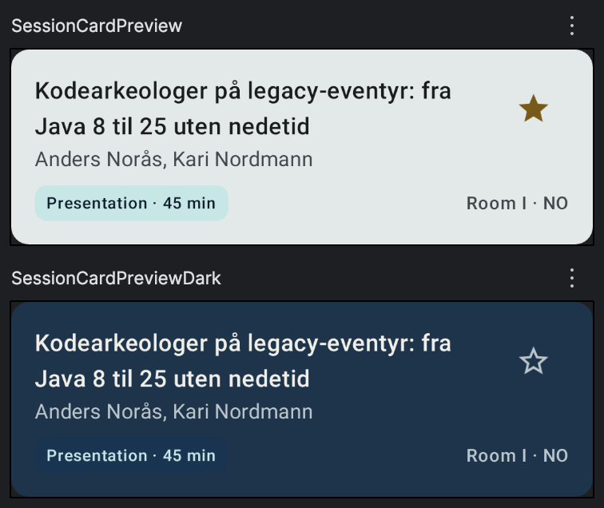

# Task 1 — `SessionCard`

**Goal:** build the composable that renders one session in the list.

**Start from:** `main` · **Finished result:** `checkpoint-1`

What you're aiming for — the two `@Preview`s (light and dark) as the IDE renders them:



## Theory recap

See *Block 1 — Building the UI with Compose*: `@Composable` functions *emit* UI,
you compose functions from `Column`/`Row`/`Box` and Material 3 components, and
`@Preview` renders them in the IDE. Every component takes a trailing
`modifier: Modifier = Modifier` by convention.

## Steps

1. Create `SessionCard.kt` in `ui/components/`.
2. Make a `Card(onClick = …)` containing a `Column`, padded 16.dp.
3. Top row: the title (`titleMedium`, `maxLines = 2`, ellipsis, `Modifier.weight(1f)`)
   and a favorite `IconButton` to its right.
4. Below: the speaker names (`bodyMedium`, `onSurfaceVariant`), then a bottom row
   with a **format badge** on the left and `room · LANGUAGE` on the right.
5. Add a `FormatBadge` sub-composable: a coloured `Surface` whose text
   *names* the format.
6. `@Preview` it with `sampleSession` — one **light**, one **dark**.
7. In **`App.kt`**: replace the "N sessions loaded" placeholder with a small
   scrollable `Column` showing `SessionCard`s from the loaded list
   (`checkpoint-1` shows the first 12).

> **The `@Preview` import:** use
> `import androidx.compose.ui.tooling.preview.Preview` — the one your IDE offers
> first. It works in `commonMain` on all four targets here (the starter depends
> on `org.jetbrains.compose.ui:ui-tooling-preview`, which publishes the
> annotation under the androidx name for every platform). If you see a
> deprecation warning on an `org.jetbrains.compose.ui.tooling.preview.Preview`
> import, follow it — the androidx one is the current form.

## Hints

<details>
<summary>Hint 1 — nudge</summary>

The provided `sampleSession` (in `ui/components/SampleData.kt`) has everything you
need: `title`, `speakers`, `format`, `lengthMinutes`, `room`, `language`. Start
by making a `@Preview` `@Composable` in place and the card *inside* it, so you get
instant visual feedback.

For the star button, there's already a `FavoriteIconButton` idea in the finished
app, but for Task 1 a plain `IconButton` with `Icons.Filled.Star` /
`StarOutline` (provided in `StarOutlineIcon.kt`) is enough.

For step 7: `App.kt` already loads the sessions into `loaded` — swap the texts
in its `else` branch for a `Column` that loops over `loaded.take(12)` rendering
your card. Add `.verticalScroll(rememberScrollState())` to the column so the
dozen cards scroll.
</details>

<details>
<summary>Hint 2 — API / types</summary>

The signatures, as in `checkpoint-1`:

```kotlin
@Composable fun SessionCard(
    session: Session,
    isFavorite: Boolean,
    onClick: () -> Unit,
    onToggleFavorite: () -> Unit,
    selected: Boolean = false,   // used by Task 3's list/detail layout — fine to skip for now
    modifier: Modifier = Modifier,
)

@Composable fun FormatBadge(format: Format, lengthMinutes: Int? = null)

@Composable fun FavoriteIconButton(sessionTitle: String, isFavorite: Boolean, onToggle: () -> Unit)
```

- `Card(onClick = onClick, modifier = modifier.fillMaxWidth()) { … }`
- Title `Text(session.title, style = MaterialTheme.typography.titleMedium,
  maxLines = 2, overflow = TextOverflow.Ellipsis, modifier = Modifier.weight(1f))`
  — `weight` only works inside a `Row`/`Column`.
- Format colours come from the theme: `MaterialTheme.colorScheme.primaryContainer`
  (presentation), `tertiaryContainer` (lightning), `secondaryContainer` (workshop),
  each with its matching `on…Container` content colour.
- The card is **stateless**: it takes `isFavorite: Boolean` and reports
  `onToggleFavorite: () -> Unit` — it doesn't own the favorite state.
- Step 7's column in `App.kt`:
  `Column(Modifier.fillMaxSize().verticalScroll(rememberScrollState()).padding(16.dp))`,
  then `loaded.take(12).forEach { SessionCard(...) }`. A throwaway
  `remember { mutableStateOf(emptySet<String>()) }` in `App()` is enough to make
  the stars toggle.
</details>

<details>
<summary>Hint 3 — full code</summary>

Everything you need to type, in build order. 
Check your solution against it, or if you are stuck, copy parts or the whole of it. 
Make sure to import the right `@Preview` as covered in the note above.

**`ui/components/FormatBadge.kt`** (new file)

```kotlin
/** Colored session-format tag. The format is indicated by both text and color. */
@Composable
fun FormatBadge(format: Format, lengthMinutes: Int? = null) {
    val colors = MaterialTheme.colorScheme
    val (container, name) = when (format) {
        Format.PRESENTATION -> colors.primaryContainer to "Presentation"
        Format.LIGHTNING_TALK -> colors.tertiaryContainer to "Lightning"
        Format.WORKSHOP -> colors.secondaryContainer to "Workshop"
    }
    val content = when (format) {
        Format.PRESENTATION -> colors.onPrimaryContainer
        Format.LIGHTNING_TALK -> colors.onTertiaryContainer
        Format.WORKSHOP -> colors.onSecondaryContainer
    }
    Surface(color = container, contentColor = content, shape = MaterialTheme.shapes.small) {
        Text(
            text = listOfNotNull(name, lengthLabel(lengthMinutes)).joinToString(" · "),
            style = MaterialTheme.typography.labelSmall,
            modifier = Modifier.padding(horizontal = 8.dp, vertical = 4.dp),
        )
    }
}

/** Session length in minutes or hours. */
private fun lengthLabel(minutes: Int?): String? = when {
    minutes == null -> null
    minutes >= 120 && minutes % 60 == 0 -> "${minutes / 60} h"
    else -> "$minutes min"
}
```

**`ui/components/FavoriteIconButton.kt`** (`StarOutline` is already
provided in `StarOutlineIcon.kt`)

```kotlin
/**
 * Favorite toggle. The contentDescription includes the session title.
 */
@Composable
fun FavoriteIconButton(sessionTitle: String, isFavorite: Boolean, onToggle: () -> Unit) {
    IconButton(onClick = onToggle) {
        Icon(
            // Filled vs hollow shows the state
            imageVector = if (isFavorite) Icons.Filled.Star else StarOutline,
            contentDescription = if (isFavorite) {
                "Remove '$sessionTitle' from my schedule"
            } else {
                "Add '$sessionTitle' to my schedule"
            },
            tint = if (isFavorite) {
                MaterialTheme.colorScheme.tertiary
            } else {
                MaterialTheme.colorScheme.onSurfaceVariant
            },
        )
    }
}
```

**`ui/components/SessionCard.kt`** (new file — the card plus its two previews)

```kotlin
/** One session in the program list. */
@Composable
fun SessionCard(
    session: Session,
    isFavorite: Boolean,
    onClick: () -> Unit,
    onToggleFavorite: () -> Unit,
    selected: Boolean = false,
    modifier: Modifier = Modifier,
) {
    Card(
        onClick = onClick,
        modifier = modifier.fillMaxWidth(),
        colors = if (selected) {
            CardDefaults.cardColors(containerColor = MaterialTheme.colorScheme.surfaceContainerHighest)
        } else {
            CardDefaults.cardColors()
        },
    ) {
        Column(Modifier.padding(16.dp)) {
            Row(verticalAlignment = Alignment.Top) {
                Text(
                    text = session.title,
                    style = MaterialTheme.typography.titleMedium,
                    maxLines = 2,
                    overflow = TextOverflow.Ellipsis,
                    modifier = Modifier.weight(1f),
                )
                FavoriteIconButton(session.title, isFavorite, onToggleFavorite)
            }
            if (session.speakers.isNotEmpty()) {
                Text(
                    text = session.speakers.joinToString { it.name },
                    style = MaterialTheme.typography.bodyMedium,
                    color = MaterialTheme.colorScheme.onSurfaceVariant,
                    maxLines = 1,
                    overflow = TextOverflow.Ellipsis,
                )
            }
            Spacer(Modifier.height(8.dp))
            Row(verticalAlignment = Alignment.CenterVertically) {
                FormatBadge(session.format, session.lengthMinutes)
                Spacer(Modifier.weight(1f))
                Text(
                    // Room is omitted when the schedule isn't published.
                    text = listOfNotNull(session.room, session.language.uppercase()).joinToString(" · "),
                    style = MaterialTheme.typography.labelMedium,
                    color = MaterialTheme.colorScheme.onSurfaceVariant,
                )
            }
        }
    }
}

@Preview
@Composable
private fun SessionCardPreview() {
    JavaZoneTheme(darkTheme = false) {
        SessionCard(sampleSession, isFavorite = true, onClick = {}, onToggleFavorite = {})
    }
}

@Preview
@Composable
private fun SessionCardPreviewDark() {
    JavaZoneTheme(darkTheme = true) {
        SessionCard(sampleSession, isFavorite = false, onClick = {}, onToggleFavorite = {})
    }
}
```

(`selected` isn't used yet — Task 3's list/detail layout highlights the open
session with it. It has a default, so you can also just leave it out for now.)

**`App.kt`** (edit the existing file)

Keep the loading logic as it is. Inside the `Surface`, replace the whole
`Column` — the one holding the spinner and the "N sessions loaded" texts —
with a spinner branch and a scrollable column of cards:

```kotlin
val loaded = sessions
if (loaded == null) {
    Column(
        modifier = Modifier.fillMaxSize(),
        horizontalAlignment = Alignment.CenterHorizontally,
        verticalArrangement = Arrangement.Center,
    ) {
        CircularProgressIndicator()
    }
} else {
    var favoriteIds by remember { mutableStateOf(emptySet<String>()) }
    Column(
        modifier = Modifier
            .fillMaxSize()
            .verticalScroll(rememberScrollState())
            .padding(16.dp),
        verticalArrangement = Arrangement.spacedBy(8.dp),
    ) {
        Text(
            text = "JavaZone 2026",
            style = MaterialTheme.typography.headlineMedium,
            color = MaterialTheme.colorScheme.primary,
            modifier = Modifier.padding(bottom = 8.dp),
        )
        loaded.take(12).forEach { session ->
            SessionCard(
                session = session,
                isFavorite = session.id in favoriteIds,
                onClick = {},
                onToggleFavorite = {
                    favoriteIds = if (session.id in favoriteIds) {
                        favoriteIds - session.id
                    } else {
                        favoriteIds + session.id
                    }
                },
            )
        }
    }
}
```
</details>

## Done when…

- [ ] `SessionCard` renders title, speakers, a format badge and room/language.
- [ ] The star reflects `isFavorite` and calls `onToggleFavorite` — the card owns
      no state of its own.
- [ ] The star's `contentDescription` includes the session title (accessibility).
- [ ] You have a **light and a dark** `@Preview` using `sampleSession`.
- [ ] `App()` shows a few `SessionCard`s (e.g. a small `Column` of samples).

## Expected result

A Material card showing one session, in both light and dark, with a working star.
`checkpoint-1` puts a handful of cards on screen in `App()`.
