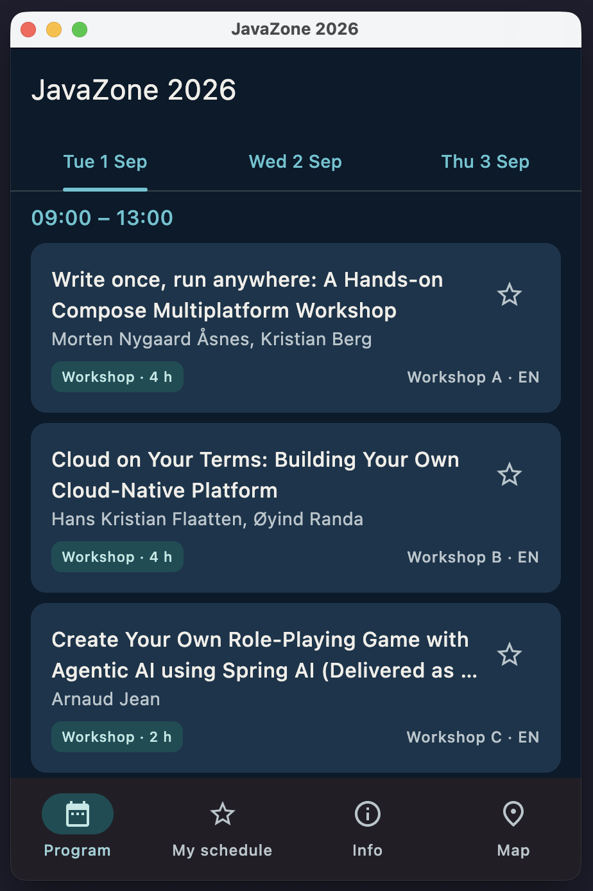

# Task 3 — Adaptive layout

**Goal:** bottom navigation bar on a phone, navigation rail + two panes on a wide
screen — the *same code* adapting to the window size.

**Start from:** `checkpoint-2` · **Finished result:** `checkpoint-3`

> `checkpoint-3` is more than this task's solution: it also ships the ready-made
> screens and the `ProgramUiState` skeleton that Task 4 starts from.

What you're aiming for — the same build, the same code, three window widths:

| Compact — bottom bar, one pane | Medium — rail, one pane | Expanded — rail + two panes |
| :---: | :---: | :---: |
|  |  |  |

(The detail pane is fuller here than yours needs to be — see step 5.)

## Theory recap

See *Block 1 — One codebase, every window size*: Material window **size classes**
bucket the width into Compact / Medium / Expanded. **Two breakpoints, two
independent decisions**: the nav container changes at **600 dp** (bar ↔ rail);
the pane layout changes at **840 dp** (single pane ↔ list-detail). Adaptive layout
is just state — on desktop it updates live as you drag the window edge.

## Steps

1. Add `currentWindowWidth()` using `currentWindowAdaptiveInfo().windowSizeClass`,
   folded into a small `enum WindowWidth { Compact, Medium, Expanded }`.
2. Add a `TopDestination` enum with one entry per tab — Program, My schedule,
   Info, Map. Each entry carries the data its nav item needs: a `route` (a
   `String` id for that tab), a `label` for the text, and **two** icons — a
   filled one for when the tab is selected and an outlined one for when it
   isn't. Both the bar and the rail are built by looping over
   `TopDestination.entries`
3. Build `AdaptiveScaffold`: a `Scaffold` with a `NavigationBar` when
   `Compact`, otherwise a `Row` with a `NavigationRail` on the left + the content.
4. Add `ListDetailLayout(expanded, list, detail)`: a weighted `Row` (≈0.42 / 0.58)
   when `expanded`, otherwise just `list()`.
5. Track a `selectedSessionId` and pass `selected = session.id == selectedSessionId`
   into `SessionCard` so the chosen card highlights in the two-pane view.
   **The detail pane itself can be a placeholder** — the selected session's title
   plus an `EmptyState`/"select a session" message when nothing is selected is
   plenty. The real detail screen is Task 4 material (`checkpoint-3` already
   contains a fleshed-out `SessionDetailContent`, so don't worry if yours looks
   sparser than the checkpoint — the layout mechanics are what this task is about).
6. **Run on Desktop and resize** across 600 dp and 840 dp — watch it adapt.

## Hints

<details>
<summary>Hint 1 — nudge</summary>

`currentWindowAdaptiveInfo()` comes from the `material3-adaptive` library (already
a dependency). The two breakpoint constants live on `WindowSizeClass`:
`WIDTH_DP_MEDIUM_LOWER_BOUND` (600) and `WIDTH_DP_EXPANDED_LOWER_BOUND` (840).
Keep selection state (`selectedSessionId`) in a `remember { mutableStateOf(...) }`
for now — moving it into a ViewModel is Task 4.
</details>

<details>
<summary>Hint 2 — API / types</summary>

The signatures, as in `checkpoint-3` (everything new lives in one file,
`ui/AdaptiveScaffold.kt`, except `ListDetailLayout`):

```kotlin
enum class WindowWidth { Compact, Medium, Expanded }

@Composable fun currentWindowWidth(): WindowWidth

enum class TopDestination(
    val route: String,
    val label: String,
    val filledIcon: ImageVector,
    val outlinedIcon: ImageVector,
) { Program, Schedule, Info, Map }   // each entry supplies its route/label/icons

@Composable fun AdaptiveScaffold(
    windowWidth: WindowWidth,
    currentRoute: String?,
    onNavigate: (String) -> Unit,
    content: @Composable () -> Unit,
)

@Composable fun ListDetailLayout(
    expanded: Boolean,
    list: @Composable () -> Unit,
    detail: @Composable () -> Unit,
)
```

And two existing composables change:

```kotlin
@Composable fun ProgramScreen(sessions: List<Session>, expanded: Boolean)  // gains `expanded`

@Composable fun SessionList(/* …as before… */, selectedSessionId: String? = null, modifier: Modifier = Modifier)
```

- `currentWindowWidth()` folds `currentWindowAdaptiveInfo().windowSizeClass`
  through `isWidthAtLeastBreakpoint(...)` with
  `WindowSizeClass.WIDTH_DP_EXPANDED_LOWER_BOUND` (840) and
  `WIDTH_DP_MEDIUM_LOWER_BOUND` (600).
- `NavigationBarItem` (bar) and `NavigationRailItem` (rail) take the same
  `selected` / `onClick` / `icon` / `label` — drive both from
  `TopDestination.entries` so they can't drift apart.
- If your Task 1 `SessionCard` declared `selected` but never *used* it, now is
  the time to wire it up:

  ```kotlin
  Card(
      onClick = onClick,
      colors = if (selected)
          CardDefaults.cardColors(containerColor = MaterialTheme.colorScheme.surfaceContainerHighest)
      else CardDefaults.cardColors(),
      // …
  )
  ```
</details>

<details>
<summary>Hint 3 — full code (copy-paste solves the task)</summary>

Everything you need to type, in build order. Two imports the IDE may need help
with: `WindowSizeClass` is `androidx.window.core.layout.WindowSizeClass`, and
`currentWindowAdaptiveInfo` comes from `androidx.compose.material3.adaptive`.

**`ui/AdaptiveScaffold.kt`** (new file — width class, destinations, and the
scaffold together)

```kotlin
/** Width class — decisions are made on width only. */
enum class WindowWidth { Compact, Medium, Expanded }

@Composable
fun currentWindowWidth(): WindowWidth {
    val sizeClass = currentWindowAdaptiveInfo().windowSizeClass
    return when {
        sizeClass.isWidthAtLeastBreakpoint(WindowSizeClass.WIDTH_DP_EXPANDED_LOWER_BOUND) -> WindowWidth.Expanded
        sizeClass.isWidthAtLeastBreakpoint(WindowSizeClass.WIDTH_DP_MEDIUM_LOWER_BOUND) -> WindowWidth.Medium
        else -> WindowWidth.Compact
    }
}

/** The four top-level destinations; selected = filled icon, unselected = outlined. */
enum class TopDestination(
    val route: String,
    val label: String,
    val filledIcon: ImageVector,
    val outlinedIcon: ImageVector,
) {
    Program("program", "Program", Icons.Filled.DateRange, Icons.Outlined.DateRange),
    Schedule("schedule", "My schedule", Icons.Filled.Star, StarOutline),
    Info("info", "Info", Icons.Filled.Info, Icons.Outlined.Info),
    Map("map", "Map", Icons.Filled.Place, Icons.Outlined.Place),
}

/**
 * The two-breakpoint rule: only the navigation container changes at 600 dp;
 * the Program pane split changes separately at 840 dp.
 */
@Composable
fun AdaptiveScaffold(
    windowWidth: WindowWidth,
    currentRoute: String?,
    onNavigate: (String) -> Unit,
    content: @Composable () -> Unit,
) {
    if (windowWidth == WindowWidth.Compact) {
        Scaffold(
            bottomBar = {
                NavigationBar {
                    TopDestination.entries.forEach { destination ->
                        val selected = currentRoute == destination.route
                        NavigationBarItem(
                            selected = selected,
                            onClick = { onNavigate(destination.route) },
                            icon = {
                                Icon(
                                    if (selected) destination.filledIcon else destination.outlinedIcon,
                                    contentDescription = null,
                                )
                            },
                            label = { Text(destination.label) },
                        )
                    }
                }
            },
        ) { padding ->
            // consumeWindowInsets: the inner screens have their own TopAppBars, which
            // must not re-apply the status-bar inset this Scaffold already handled.
            Box(Modifier.padding(padding).consumeWindowInsets(padding)) { content() }
        }
    } else {
        Row(Modifier.fillMaxSize()) {
            NavigationRail {
                TopDestination.entries.forEach { destination ->
                    val selected = currentRoute == destination.route
                    NavigationRailItem(
                        selected = selected,
                        onClick = { onNavigate(destination.route) },
                        icon = {
                            Icon(
                                if (selected) destination.filledIcon else destination.outlinedIcon,
                                contentDescription = null,
                            )
                        },
                        label = { Text(destination.label) },
                    )
                }
            }
            Box(Modifier.weight(1f)) { content() }
        }
    }
}
```

**`ui/components/ListDetailLayout.kt`** (new file)

```kotlin
/**
 * The Task 3 punchline: on expanded windows "detail" is a second pane, not a
 * navigation destination. Compact/medium render only the list; the detail is
 * a pushed route there.
 */
@Composable
fun ListDetailLayout(
    expanded: Boolean,
    list: @Composable () -> Unit,
    detail: @Composable () -> Unit,
) {
    if (expanded) {
        Row(Modifier.fillMaxSize()) {
            Box(Modifier.weight(0.42f)) { list() }
            Box(Modifier.weight(0.58f)) { detail() }
        }
    } else {
        list()
    }
}
```

**`ui/components/SessionList.kt`** (edit the existing file)

Add a `selectedSessionId` parameter (before `modifier`) and hand it on to each
card:

```kotlin
fun SessionList(
    // …existing parameters…
    selectedSessionId: String? = null,
    modifier: Modifier = Modifier,
) {
```

and in the `items { … }` block, add one argument to the `SessionCard` call:

```kotlin
SessionCard(
    // …existing arguments…
    selected = session.id == selectedSessionId,
)
```

**`ui/program/ProgramScreen.kt`** (edit the existing file — replace the whole
`ProgramScreen` function. The detail pane here is a placeholder, which is all
this task needs; `checkpoint-3` ships a fleshed-out `SessionDetailContent` on
top of that, so Task 4 has a real detail screen to navigate to — see the note
in step 5.)

```kotlin
@OptIn(ExperimentalMaterial3Api::class)
@Composable
fun ProgramScreen(sessions: List<Session>, expanded: Boolean) {
    val days = remember(sessions) { sessions.toConferenceDays() }
    var selectedDay by remember(days) { mutableStateOf(days.firstOrNull()?.date) }
    var favoriteIds by remember { mutableStateOf(emptySet<String>()) }
    var selectedSessionId by remember { mutableStateOf<String?>(null) }

    Scaffold(topBar = { TopAppBar(title = { Text("JavaZone 2026") }) }) { padding ->
        Column(Modifier.padding(padding).fillMaxSize()) {
            DayTabRow(days.map { it.date }, selectedDay) { selectedDay = it }

            val slots = remember(days, selectedDay) {
                days.firstOrNull { it.date == selectedDay }?.slots.orEmpty()
            }
            ListDetailLayout(
                expanded = expanded,
                list = {
                    if (slots.isEmpty()) {
                        EmptyState(
                            icon = Icons.Outlined.DateRange,
                            title = "No sessions",
                            body = "There are no sessions on this day.",
                        )
                    } else {
                        SessionList(
                            slots = slots,
                            favoriteIds = favoriteIds,
                            onSessionClick = { selectedSessionId = it },
                            onToggleFavorite = { id ->
                                favoriteIds =
                                    if (id in favoriteIds) favoriteIds - id else favoriteIds + id
                            },
                            selectedSessionId = if (expanded) selectedSessionId else null,
                        )
                    }
                },
                detail = {
                    val session = sessions.firstOrNull { it.id == selectedSessionId }
                    if (session == null) {
                        EmptyState(
                            icon = Icons.Outlined.DateRange,
                            title = "Select a session",
                            body = "Pick a session from the list to see its details.",
                        )
                    } else {
                        // Placeholder detail pane — the real detail screen arrives in Task 4.
                        Column(
                            Modifier.fillMaxSize()
                                .verticalScroll(rememberScrollState())
                                .padding(16.dp),
                        ) {
                            Text(session.title, style = MaterialTheme.typography.headlineSmall)
                            Text(
                                session.abstract,
                                style = MaterialTheme.typography.bodyMedium,
                                modifier = Modifier.padding(top = 8.dp),
                            )
                        }
                    }
                },
            )
        }
    }
}
```

**`App.kt`** (edit the existing file)

Keep `loadBundledSessions()` and the `JavaZoneTheme` wrapper as they are.
Replace the body of `App()` — the `Surface` and everything inside it — so the
`AdaptiveScaffold` wraps the loading/route logic:

```kotlin
JavaZoneTheme {
    val sessions by produceState<List<Session>?>(initialValue = null) {
        value = loadBundledSessions()
    }
    val windowWidth = currentWindowWidth()
    val expanded = windowWidth == WindowWidth.Expanded
    var currentRoute by remember { mutableStateOf(TopDestination.Program.route) }

    Surface(Modifier.fillMaxSize(), color = MaterialTheme.colorScheme.background) {
        AdaptiveScaffold(
            windowWidth = windowWidth,
            currentRoute = currentRoute,
            onNavigate = { currentRoute = it },
        ) {
            val loaded = sessions
            if (loaded == null) {
                Column(
                    modifier = Modifier.fillMaxSize(),
                    horizontalAlignment = Alignment.CenterHorizontally,
                    verticalArrangement = Arrangement.Center,
                ) {
                    CircularProgressIndicator()
                }
            } else {
                when (currentRoute) {
                    TopDestination.Program.route -> ProgramScreen(loaded, expanded)
                    TopDestination.Schedule.route -> EmptyState(
                        icon = Icons.Outlined.Star,
                        title = "My schedule",
                        body = "Coming in Task 4 — mark sessions with the star.",
                    )
                    TopDestination.Info.route -> EmptyState(
                        icon = Icons.Outlined.Info,
                        title = "Practical info",
                        body = "Coming in Task 4.",
                    )
                    TopDestination.Map.route -> EmptyState(
                        icon = Icons.Outlined.Place,
                        title = "Venue map",
                        body = "Coming in Task 6.",
                    )
                }
            }
        }
    }
}
```

The point: on a wide screen "detail" is a **second pane** (state), on a phone
it's a **pushed destination** (navigation). The full version — including the
real detail content — is in `checkpoint-3`.
</details>

## Done when…

- [ ] Narrow window → bottom `NavigationBar`; wide window → left `NavigationRail`.
- [ ] At ≥840 dp the Program screen shows two panes (list + detail).
- [ ] The selected card highlights (`selected` parameter).
- [ ] Resizing the desktop window across 600/840 dp adapts live.

## Expected result

The same build, resized, moves through all three columns of the size-class table:
bottom bar → rail → rail + two panes. `checkpoint-3` gets everyone level before
the architecture block — it also carries some provided-but-unused material for
Task 4: the extra screens, a `ProgramUiState` skeleton full of `TODO()`s, and an
`AdaptiveScaffold` that hides the bottom bar on the session-detail route (dead
code until Task 4 adds that route). Ignore those for now.

> **Note (task order):** the `selectedSessionId` plumbing is deliberately a little
> awkward while state still lives in `remember` inside composables. That friction
> is the motivation for Task 4 — don't over-engineer it here.
